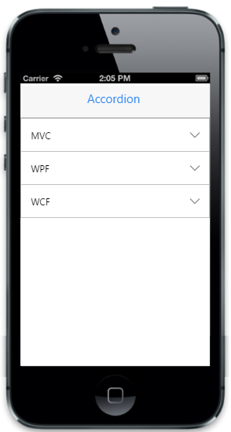

# Collapse content

In some cases, you may want to collapse the Accordion content dynamically due to limited space available in the screen. You can enable this feature by setting “data-ej-collapseall attribute to true. By clicking the Accordion header, you can collapse or expand the content.



    

        

            <ul>

                <li data-ej-text="MVC">

                    

                        Model-view-controller (MVC) is a software architecture pattern which separates the representation of information from the user's interaction with it. The model consists of application data, business rules, logic, and functions

                    

                </li>

                <li data-ej-text="WPF">

                    

                        Developed by Microsoft, the Windows Presentation Foundation (or WPF) is a computer-software graphical subsystem for rendering user interfaces in Windows-based applications.

                    

                </li>

                <li data-ej-text="WCF">

                    

                        WCF is a tool often used to implement and deploy a service-oriented architecture (SOA). It is designed using service-oriented architecture principles to support distributed computing where services have remote consumers.

                    

                </li>

            </ul>
        

    



The following screenshot displays the collapse content:

