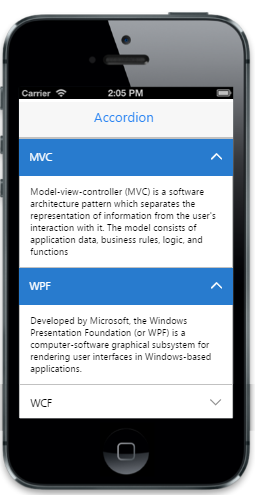

# Expand multiple content

The data-ej-enablemultipleopen attribute is used to display or expand more than one item at a time. The index of the items to be expanded can be specified by using data-ej-selecteditems attribute as an array.



     <ul>

         <li data-ej-text="MVC">

            

             Model-view-controller (MVC) is a software architecture pattern which separates the representation of information from the user's interaction with it. The model consists of application data, business rules, logic, and functions

             

         </li>

         <li data-ej-text="WPF" >

            

             Developed by Microsoft, the Windows Presentation Foundation (or WPF) is a computer-software graphical subsystem for rendering user interfaces in Windows-based applications.

            

         </li>              

         <li data-ej-text="WCF" >

            

            WCF is a tool often used to implement and deploy a service-oriented architecture (SOA). It is designed using service-oriented architecture principles to support distributed computing where services have remote consumers.

             

         </li>  

    </ul>

 



The following screenshot displays expand multiple contents:

