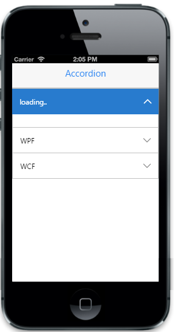

# Load on demand

Enable the "data-ej-enableajax" to load the Ajax content. To achieve this, specify “data-ej-href” attribute with the respective URL of the HTML file that contains the dynamic content. The data-ej-spinnertext attribute is used to show the loading text, while getting (waiting for) the response from the server (via Ajax request).


  

     <ul>

         <li data-ej-text="MVC" data-ej-href="text1.html"></li>

         <li data-ej-text="WPF" data-ej-href="text2.html"></li>

         <li data-ej-text="WCF" data-ej-href="text3.html"></li>

      </ul>

 



Create an HTML file with the name text1.html.



<body>

    Model-view-controller (MVC) is a software architecture pattern which separates the representation of information from the user's interaction with it.

    The model consists of application data, business rules, logic, and functions

</body>



Create an HTML file with the name text2.html.



<body>

    Developed by Microsoft, the Windows Presentation Foundation (or WPF) is a computer-software graphical subsystem for rendering user interfaces in Windows-based applications.

</body>



Create an HTML file with the name text3.html.



<body>

    WCF is a tool often used to implement and deploy a service-oriented architecture

    (SOA). It is designed using service-oriented architecture principles to support

    distributed computing where services have remote consumers.

</body>



The following screenshot displays the load on demand:

