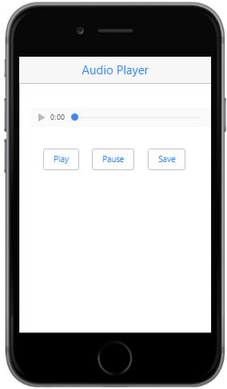
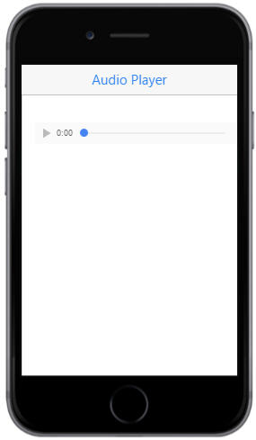

# Getting Started

## Create your first Menu in JavaScript

From the following guidelines, you can create a Media Player App where you can learn the mobile button features.

The following screenshot illustrates the functionality of a Button control in Media Player.

### Create the necessary layout

Create an HTML file and paste the following template to it for Button creation.



    <!DOCTYPE html>
    <html>
    <head>
        <meta id="viewport" name="viewport" content="width=device-width, initial-scale=1.0,maximum-scale=1.0, user-scalable=no" />
        <title>Button</title>
        <link rel="stylesheet" href="http://cdn.syncfusion.com/14.3.0.49/js/mobile/ej.mobile.all.min.css" />
        
        
        
        <!--Add custom scripts here -->
    </head>
    <body>
        

            

            

                

                    <!--Mobile Button control  -->                
                

            

        

    </body>
    </html>



Add the following styles to add formatting to your page.



    .center {
    padding: 20px;
    top: 20px;
    position: relative;
    }
    td {
    padding: 10px;
    }
	   


You can add Audio controls in your app by using html audio control. Add the following code example inside the Div element. 



    <!--Audio-->

    <audio controls id="audio">

        <source src="audio/song.wav" type="audio/wav">

        <source src="audio/song.ogg" type="audio/ogg">

        <source src="audio/song.mp3" type="audio/mp3">

    </audio>

     
     



N> Make sure you have an audio file in specified location.

Run the above code example to render the following output.

### Create Button Widget

To render the Button control, set “data-role” attribute to “ejmbutton” to an “input” element.

In your Media player, add three buttons for “Play”, “Pause” and “Save” as per the following code.



    <table>
           <tr>
                <td>
                    <input type="button" id="play" data-role="ejmbutton" />
                </td>
                <td>
                    <input type="button" id="pause" data-role="ejmbutton" />
                </td>
                <td>
                    <input type="button" id="stop" data-role="ejmbutton" />
                </td>
           </tr>
     </table>



### Set text

Now, set text for all the buttons. You can achieve this by using “data-ej-text” attribute. 



<!--Button-->

    <table>
            <tr>
                <td>
                    <input type="button" id="play" data-role="ejmbutton" data-ej-text="Play"/>
                </td>
                <td>
                    <input type="button" id="pause" data-role="ejmbutton" data-ej-text="Pause" />
                </td>
                <td>
                    <input type="button" id="stop" data-role="ejmbutton" data-ej-text="Save" />
                </td>
            </tr>
    </table>



### Saving the Audio file

Simply, a Dialog control is added to alert you when the file is saved.

For this purpose, use Mobile dialog control that can be rendered with the code example provided as follows.



    

         

            Your Audio has been saved.
         

    



### Binding Events

You can bind Button controls touch events to the html audio control by using the events provided by Button Widget.

You can achieve this by using “data-ej-touchend” attribute.



<!--Button-->

     <table>
          <tr>
              <td>
                  <input type="button" id="play" data-role="ejmbutton" data-ej-text="Play" data-ej-touchend="play" />
              </td>
              <td>
                  <input type="button" id="pause" data-role="ejmbutton" data-ej-text="Pause" data-ej-touchend="pause" />
              </td>
              <td>
                  <input type="button" id="stop" data-role="ejmbutton" data-ej-text="Save"  data-ej-touchend="save" />
              </td>
          </tr>
    </table>



At this point, you have created all the elements required for a simple Mediaplayer.

Next, write a code for binding button events with Audio control.

You can achieve this by using the following Script.



var v = document.getElementsByTagName("audio")[0];

v.pause();

function play() {

	v.play();

}

function pause() {

	v.pause();

}

function save() {

	App.activePage.find("#alertdlg").ejmDialog("open");

}

function alertClose(args) {

	App.activePage.find("#alertdlg").ejmDialog("close");

}

