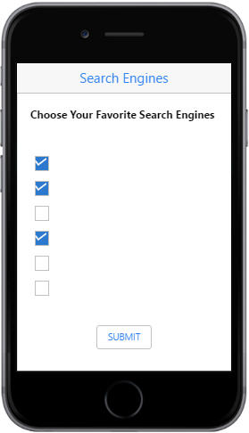

# Getting Started

This section briefly describes about how to create and customize Essential JS Mobile Checkbox widget.

## Create your first Checkbox in JavaScript

From the following guidelines, you can select Multiple or Single Selection List by using Checkbox. The following screenshot demonstrates the functionality with Checkbox button action.

In the above screenshot, you can select multiple search engines as your favorites by using Checkbox, Tri-State Checkbox and perform the action to render the checked values when the button is clicked.

### Create Checkbox 

Essential JavaScript Mobile Checkbox widget has built-in features like indeterminate selections. You can easily create the Checkbox widget by using a simple input Checkbox element as follows.

Create an HTML file and add the following template to the HTML file.



<!DOCTYPE html>

    <html>
	<head>
        <meta id="viewport" name="viewport" content="width=device-width, initial-scale=1.0,maximum-scale=1.0, user-scalable=no" />
        <title>Checkbox</title>
        <link rel="stylesheet" href="http://cdn.syncfusion.com/14.3.0.49/js/mobile/ej.mobile.all.min.css" />
        
        
        
        <!--Add custom scripts here -->
    </head>
	<body>
		

		
Choose Your Favorite Search Engines

		<!-- Add checkbox elements here -->
		

			<button id="submit" data-role="ejmbutton">SUBMIT</button>
		

	</body>
    </html>



To render the Checkbox control, you can set data-role attribute as “ejmcheckbox” for the specific input element as follows.



    <table id="main">
        <tr>
            <td>
                <input data-role="ejmcheckbox" type="checkbox" id="Checkbox1" data-ej-text="Google" data-ej-checked="true" />
            </td>
        </tr>
        <tr>
            <td>
                <input data-role="ejmcheckbox" type="checkbox" id="Checkbox2" data-ej-text="Yahoo" data-ej-checked="true" />
            </td>
        </tr>
        <tr>
            <td>
                <input data-role="ejmcheckbox" type="checkbox" id="Checkbox3" data-ej-text="Bing" />
            </td>
        </tr>
        <tr>
            <td>
                <input data-role="ejmcheckbox" type="checkbox" id="Checkbox4" data-ej-text="Wikipedia" data-ej-checked="true" />
            </td>
        </tr>
        <tr>
            <td>
                <input data-role="ejmcheckbox" type="checkbox" id="Checkbox5" data-ej-text="Amazon" />
            </td>
        </tr>
        <tr>
            <td>
                <input data-role="ejmcheckbox" type="checkbox" id="Checkbox6" data-ej-text="Twitter" />
            </td>
        </tr>
    </table>



 Add the following styles to show the Checkbox control in an order.



	#main, .btnsub, #label  {

		padding: 20px;

	}

	#label  {

		font-weight: bold;

	}

	.btnsub  {

		text-align: center;

	}



Run this code example and you can see the following output.

