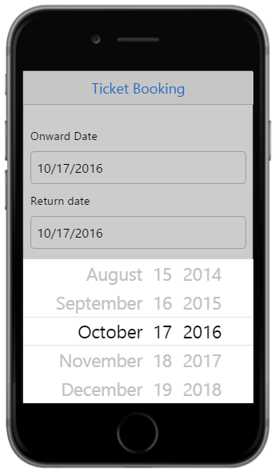
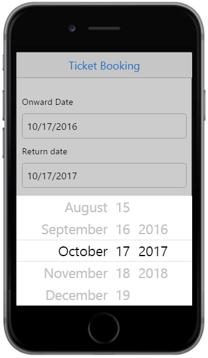
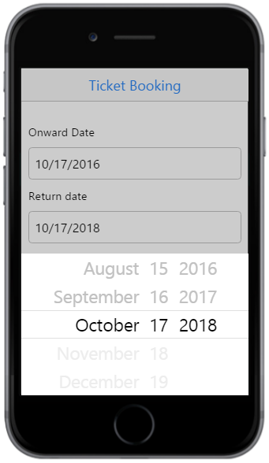

# Getting Started

The DatePicker control provides support for displaying DatePicker calendar in a web page and also allows the user to pick or directly enter the date value in it. 

By following the below guidelines, you can learn how to customize two DatePickers for a real-time ticket booking scenario. The following screenshot demonstrates the ticket booking scenario where the DatePickers are employed.

## Create a DatePicker

You can create a DatePicker widget easily by using simple input element. 

Create an HTML file and add the following code example to it.



<!DOCTYPE html>
<html>
<head>
    <title>Ticket Booking</title>
    <meta id="viewport" name="viewport" content="width=device-width, initial-scale=1.0,maximum-scale=1.0, user-scalable=no" />
    <link href="[http://cdn.syncfusion.com/{{ site.releaseversion }}/js/mobile/ej.mobile.all.min.css](http://cdn.syncfusion.com/{{ site.releaseversion }}/js/mobile/ej.mobile.all.min.css)" rel="stylesheet" />
    
    
    
</head>
<body>
    

        

        <!--Add Datepicker element here-->
    

</body>
</html>
	   


To provide the header title in the layout, set the `data-ej-title` attribute with the desired title value. In this case, you can set it as **Ticket Booking**.



  

To render the DatePicker control, set the `ejmdatepicker` to `data-role` attribute for the specific input element as follows.



   <table>
        <tr>
            <td class="tdclass">Onward Date</td>
        </tr>
        <tr>
            <td class="tdclass">
                
                    <input id="startDate" data-role="ejmdatepicker" />
                
            </td>
        </tr>
        <tr>
            <td class="tdclass">Return date</td>
        </tr>
        <tr>
            <td class="tdclass">
                
                    <input id="endDate" data-role="ejmdatepicker" />
                
            </td>
        </tr>
   </table>
	 


Add the following styles to display the DatePicker’s input element.



	   

   
Run the above code example, to render the DatePicker.

## Setting Min and Max Date 

In a real-time ticket booking scenario, the booking is open for a limited number of days only. You can select any date, only in that range. This can be achieved by using the attributes `data-ej-mindate` and `data-ej-maxdate`. 

The following code helps you to set the mindate and maxdate.





Run the above code example to render a DatePicker with Min and Max Date as shown in the below image.

## Validations on Min and Max Date Values

You can select Onward journey date in the first DatePicker. The Return journey date is selected in second date picker after selecting Onward journey date. This validation process is done after the selection of Onward journey date and the changes are reflected on the Return journey date selection DatePicker. Manipulate this process by using the **select** event of Onward journey date DatePicker by using `data-ej-select` attribute. 

The following code example explains how to set an event to process the Min and Max Date Validations.



   <table>
        <tr>
            <td class="tdclass">Onward Date</td>
        </tr>
        <tr>
            <td class="tdclass">
                
                    <input id="startDate" data-role="ejmdatepicker" data-ej-select="validateMinDateForReturn" />
                
            </td>
        </tr>
        <tr>
            <td class="tdclass">Return date</td>
        </tr>
        <tr>
            <td class="tdclass">
                
                    <input id="endDate" data-role="ejmdatepicker" />
                
            </td>
        </tr>
    </table>



The `select` event is handled by the user-defined `validateMinDateForReturn` function as follows.





The above code example outputs the following image.

