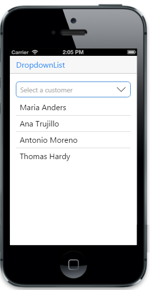

# Data Binding

## Local Data Binding

Essential Studio mobile JS DropDownList provides support for Data Binding.Elements can be bounded to data from a variety of data sources. In local Data Binding, the data source is written inside the program. Then it is handled by the DropDownList control.data-ej-datasource attribute is used to get the data source that holds the list items.



   <input type="text" id="dd_grouping" data-role="ejmdropdownlist" data-ej-datasource="window.listData"
            data-ej-watermarktext="Select a Country" data-ej-fields-text="name"/>



To include datasource, add the following script.



        window.listData = [{ name: "Australia"},
                           { name: "Brazil" },
                           { name: "China" },
                           { name: "India"},
                           { name: "Spain" },
                           { name: "United States of America" }
        ];



The following screenshot displays the Local Data Binding:

## Remote Data Binding

In Remote Data Binding, the data is retrieved from a particular URL unlike the local Data Binding and then it is handled by the DropDownList control. Datasource is used to get the data that holds the list items.



  <input type="text" id="dd_grouping" data-role="ejmdropdownlist" data-ej-datasource="window.datasource"
            data-ej-fields-text="ContactName" data-ej-watermarktext="Select a customer" />



To include datasource, add the following script.



// DataManager creation.

        window.datasource = ej.DataManager({
            url: "http://mvc.syncfusion.com/Services/Northwnd.svc/Customers"
        });

window.dbitem = { "text": "ShipCity" };



The following screenshot displays the remote Data Binding:

