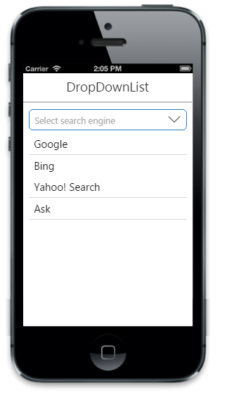
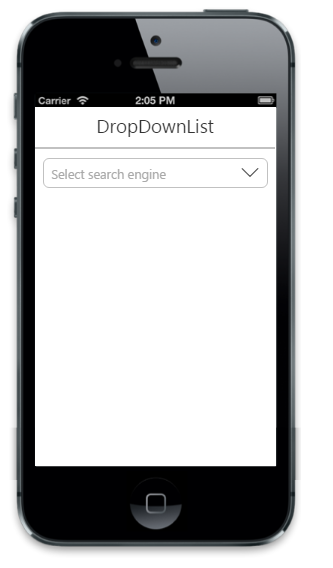
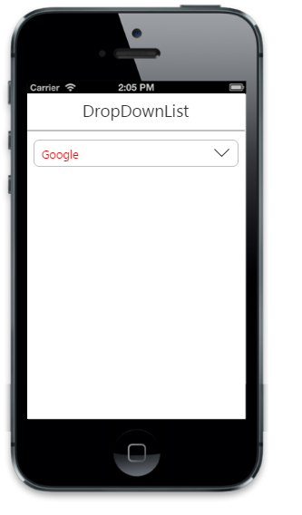

# Getting started

This section explains briefly about how to create a dropdownlist in your application with JavaScript.
Essential JavaScript dropdownlist provides support for multiple selections, within your web page and allows you to specify an option from the list. 
The following screenshot demonstrates the functionality with dropdownlist action.

For getting started you can use the ‘ej.mobile.all.min.js’ file, which encapsulates all the ‘ejm’ controls and frameworks in one single file.
For themes, you can use the ‘ej.mobile.all.min.css’ CDN link from the snippet given. To add the themes in your application, please refer this link.

## Create basic mobile layout

Create an HTML file and paste the following template for mobile layout.



<!DOCTYPE html>
<html>
<head>
    <meta id="viewport" name="viewport" content="width=device-width, initial-scale=1.0,maximum-scale=1.0, user-scalable=no" />
    <title>Navigation Drawer</title>
    <link href="http://cdn.syncfusion.com/{{ site.releaseversion }}/js/mobile/ej.mobile.all.min.css" rel="stylesheet" />
                    
     
</head>
<body>
    

        <!-- Adding Header Control Here -->
        <!-- Adding DropDownlist Control here -->
		<!--Adding list of Options -->
    

</body>
</html>



## Create DropDownList control

To Create DropDownList control, specify ejmdropdownlist as data-role attribute for a &#60;input&#62; element. You can set the text for list items by using data-ej-text attribute.



    <!-- Adding DropDownList Control here -->
    

        <input type="text" id="dd_default" data-role="ejmdropdownlist" data-ej-watermarktext="Select search engine" />
    

   
   <!--Adding list of Options -->
   


Run the above code to render the following output.

## Add list of options

Specifies the data-ej-targetid attribute for  target element which consists the list of options to render DropDownList. 



    <!-- Adding DropDownList Control here -->
  

        <input type="text" id="dd_default" data-role="ejmdropdownlist" data-ej-targetid="targetEle" data-ej-watermarktext="Select search engine" />
    

	<!--Adding list of options -->
    <ul id="targetEle">
        <li data-ej-text="Google"></li>
        <li data-ej-text="Bing"></li>
        <li data-ej-text="Yahoo! Search"></li>
        <li data-ej-text="Ask"></li>
        <li data-ej-text="Aol Search"></li>
        <li data-ej-text="Wow"></li>
        <li data-ej-text="WebCrawler"></li>
        <li data-ej-text="MyWebSearch"></li>
        <li data-ej-text="Infospace"></li>
        <li data-ej-text="DuckDuckGo"></li>
        <li data-ej-text="Blekko"></li>
        <li data-ej-text="Contenko"></li>
    </ul>



Run the above code to render the following output.

## Styles and appearance

Sets the root class for DropDownList. This cssClass API helps to use custom skinning option for DropDownList control. By defining the root class using this API, we need to include this root class in CSS.



    <!-- Adding DropDownList Control here -->
  

        <input type="text" id="dd_default" data-role="ejmdropdownlist" data-ej-targetid="targetEle" data-ej-watermarktext="Select search engine" data-ej-cssclass="custom class"    />
    

    <ul id="targetEle">
        <li data-ej-text="Google"></li>
        <li data-ej-text="Bing"></li>
        <li data-ej-text="Yahoo! Search"></li>
        <li data-ej-text="Ask"></li>
        <li data-ej-text="Aol Search"></li>
    
   
    </ul>



Run the above code to render the following output.

