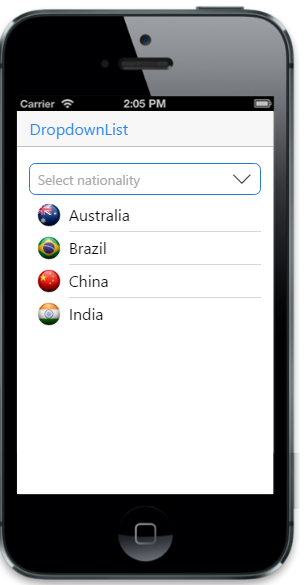

## Adding watermark text

You can add images to your DropDownList items by specifying the image class name for individual items using �data-ej-fields-image� attribute.



<input type="text" id="dd_grouping" data-role="ejmdropdownlist" data-ej-datasource="window.listData"
            data-ej-watermarktext="Select nationality" data-ej-fields-text="name" data-ej-fields-image="image" />



To include datasource, add the following script.



        window.listData = [{ name: "Australia", image: "themes/sampleimages/countries/Australia.png" },
                           { name: "Brazil", image: "themes/sampleimages/countries/Brazil.png" },
                           { name: "China", image: "themes/sampleimages/countries/china.png" },
                           { name: "India", image: "themes/sampleimages/countries/India.png" },
                           { name: "Spain", image: "themes/sampleimages/countries/Spain.png" },
                           { name: "United States of America", image: "themes/sampleimages/countries/Usa.png" }
        ];



The following screenshot displays the Local Data Binding:

