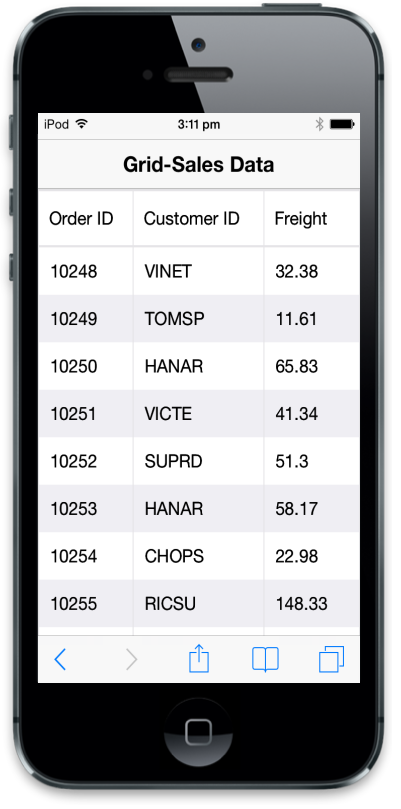
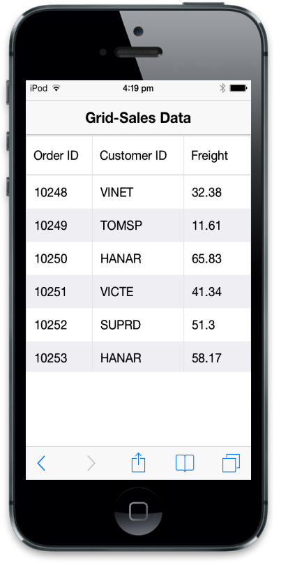
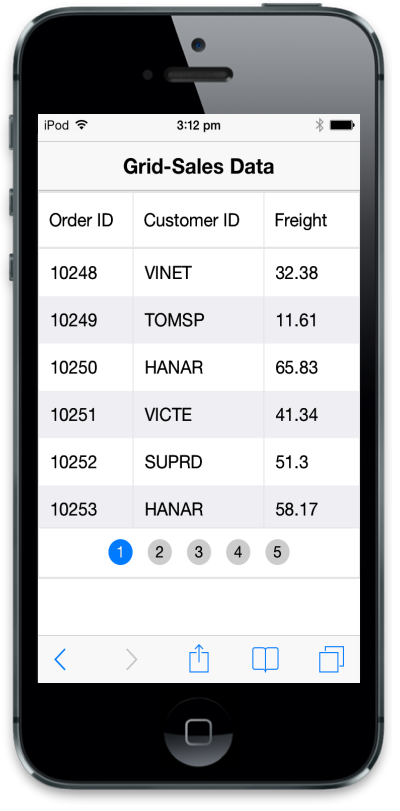
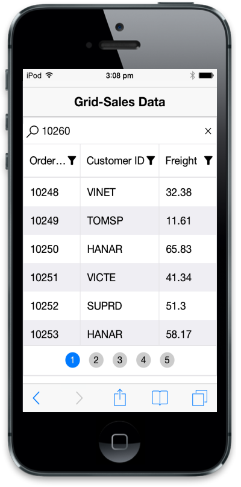
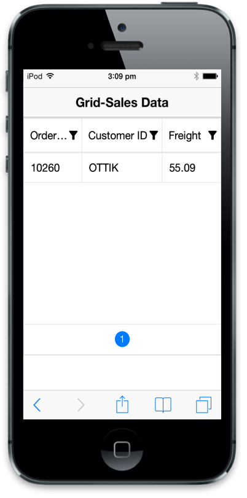

# Getting Started

In this section, you can learn how to create Grid using JavaScript in mobile app.

## Create your first Grid in JavaScript

Essential Grid for Mobile JavaScript is a feature-rich Grid component that can handle large amount of data. It is very easy to use and includes features like data binding, filtering, paging, and sorting. You can make use of the Mobile Grid control to generate complex grid-based reports. In the following guidelines, you will learn about the features in Mobile Grid widget by creating a Sales data grid.

## Create the necessary layout 

Essential JavaScript Mobile Grid can be rendered only by specifying the data source. It is rendered based on the default values for all the properties; you can easily customize Mobile Grid control by changing its properties according to your requirement. 

1. Create an HTML file and paste the following template to it for Grid creation.



<!DOCTYPE html>

<html>

<head>

    <meta id="viewport" name="viewport" content="width=device-width, initial-scale=1.0,maximum-scale=1.0, user-scalable=no" />

    <title>Grid</title>

    <link href="[http://cdn.syncfusion.com/14.3.0.49/js/mobile/ej.mobile.all.min.css](http://cdn.syncfusion.com/14.3.0.49/js/mobile/ej.mobile.all.min.css)" rel="stylesheet" />

    

    

    

    

</head>

<body>

    

        

        

        

            

                <!--Mobile Grid control  -->

            

        

        

        

    

</body>

</html>



## Create the Grid

In your Sales data grid, you require three columns to display the Order ID, Customer ID, and Freight. Create a div element for grid with its unique id. Here you don't have to specify "data-role" attribute since it's not an unobtrusive control. So the Grid control can be initialized in script by calling the widget "ejmGrid" with the necessary options. The data source can be set using the `datasource` attribute and its columns can be configured using the `columns` attribute. You can set specific properties for each field by using `columns` attribute. 

Refer to the following code example.



<!--Mobile Grid control  -->

 



Refer to the following script section.





Run this code and you can see the following output.

## Grid with Scrolling

Now, you have to enable scroll support in Grid. Scroll is used to view all the content present in the Grid when the screen size is smaller than the Grid content. For that, you have to set `allowScrolling` attribute as true. This enables the scroll panel in the Grid.  Use `scrollSettings` attribute to set scroll panel properties. Here scroll panel height has been set by using `height` attribute. 





Run this code and you can see the following output.

From the above output, it is clear that we can scroll up and down to view the Grid contents. 

## Grid with Paging

Now, enable Paging feature in Grid. This offers complete navigation support to easily switch between the pages. This can be achieved by using the pager bar available at the bottom of the Mobile Grid control. To enable paging, use `allowPaging` attribute of Grid as shown below.  Pager can be scrolled horizontally if its width exceeds the target window. The `pageSize` attribute describes the number of records to be displayed in single Grid page.





Run this code and you can see the following output.

## Grid with Filtering

Now, enable Filtering feature in Mobile Grid. A filter facilitates the extraction of a subset of records that meet certain criteria. Filters can be applied to one or more columns. To enable filtering, use the `allowFiltering` attribute of Grid.

Click the filter icon in column header to make the filtering text box visible. Then enter search content to filter your Mobile Grid data.





N> The filter query is a combination of value and symbols (<, >, =, etc). For example, you can provide "<10255" in Order ID column. The numeric columns can be filtered by using the symbols "<", ">", "=", "<=", ">=", "!" and the string columns can be filtered by using the symbols "%" (for startswith and endswith) and "*" (contains). Also , you can use "&&" and "||" operator to provide multiple conditions in single column.

Run this code and you can see the following output.

In the above output, it is clear that Order ID filter is selected and the Order ID filter column is filled with the value 10260. 

## Sortable Grid columns

Now, enable Sorting feature in Mobile Grid. Mobile Grid columns are sortable. You can sort column data either in ascending or descending order. To enable sorting, use `allowSorting` attribute of Grid as shown below. Click the column header to sort the Grid columns. The down arrow indicates that the column is sorted in ascending order and up arrow indicates that the column is sorted in descending order. If there is no arrow, it means the sorting is cleared.





Run this code and you can see the following output.

