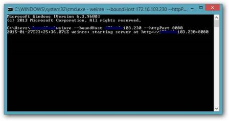
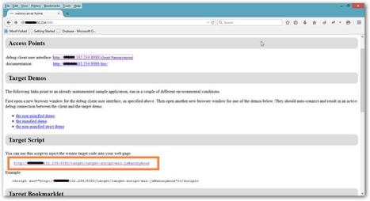
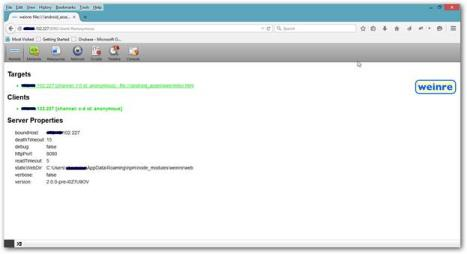
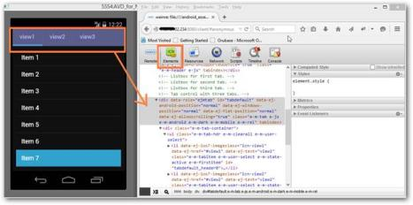
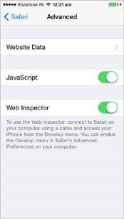
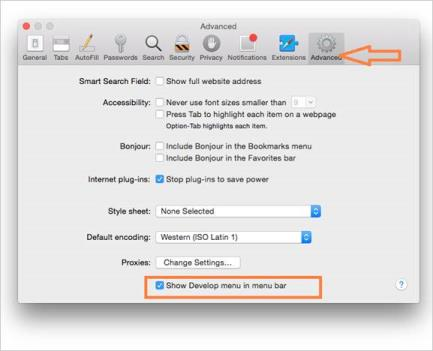
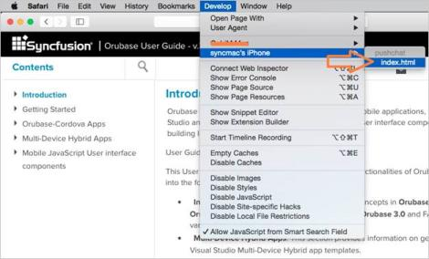

# Debugging

For debugging mobile applications in iOS, Android and Windows Phone - many mobile debugging techniques are available and this section explains about the following topics,

* Debugging using Weinre
* Debugging using Web Inspector

## Weinre

Weinre is a remote debugger for web pages similar to firebug and web inspector which is designed to work remotely. In particular, it allows you to inspect elements in web pages on a mobile device and cannot set breakpoints in JavaScript codes.

### Install Weinre

Install node.js and then type the following command in the command prompt to install the Weinre, 



npm –g install weinre



### Starting the Weinre Server

To start the Weinre server, use the following command in the command prompt,



weinre --boundHost <IPAddress> -- httpPort <port number>



The output of the following command will be displayed as below,

### Enabling Weinre in the application

To enable Weinre, enter the displayed link from command prompt (system IP and port number) in browser.

Example: [http://127.0.0.1:8080](http://127.0.0.1:8080/).

Add the script reference shown under Target Script in html file which you want to inspect elements and launch the application in mobile device to start inspecting elements.





### Debug Client User Interface

To debug any client application, connect all the remote systems in the same network.

In the browser, open debug client user interface link to get the list of available mobile devices for debugging. When an application is launched in mobile, it appears under Targets tab. Click on this link to inspect the elements.

Click the Element tab in the browser and start debugging the elements. You can change the style, edit elements, etc.

## Web Inspector

Web Inspector is used to debug web content on your iOS device directly from your desktop. It is available in iOS 6+ and it requires Mac. It has inbuilt developer option and it allows developer to inspect CSS as well as script debugging. This method is used only for iOS platform.

* Enabling Web Inspector
* Enabling Develop Menu in Mac
* Starting the Web Inspector

### Enabling Web Inspector

On your iOS device, open Settings->Safari->Advanced and turn on Web Inspector.

### Enabling Develop menu in MAC

On your Mac, Launch Safari. Open Safari Preferences and navigate to Advanced and then enable the checkbox Show Develop menu in menu bar.

N> Connect your iOS device with mac using USB cable.

### Starting the Web Inspector

Open the mobile application to debug in iOS device. In your mac, open safari and click Develop menu. Navigate to iOS device name->Open the web page (Ex: index.html)

## Remote debugging using Chrome

This method is used only to debug Android devices with the assist of Chrome browser. Go through this [Android USB debugging](https://developer.chrome.com/devtools/docs/remote-debugging). By following the simple steps provided in the link we can enable USB debugging for Android devices.