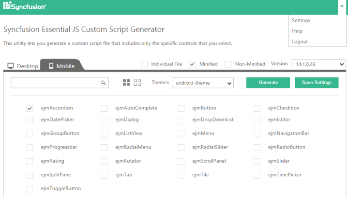

# Generating a Customized Script file

The users with Essential Studio Enterprise license or Essential Studio for JavaScript license can use the Custom Script Generator (CSG) tool to create a single file that packs together only the required scripts and CSS files together. Referring only the required scripts and stylesheets in your application instead of the default ej.mobile.all.min.js that combines the scripts of all the mobile widgets file, enhances the performance of the application’s loading time. This utility can be used to generate both the minified and non-minified version of the scripts and CSS files.

# Getting Started with Custom Script Generator

* Login into the online CSG [link](http://csg.syncfusion.com/) with your DirectTrac credentials. Switch to the Mobile tab and the Custom Script Generator Utility options will be displayed as follows,

* Select the required version from the Version list and also select the output file type either to be generated as a minified or non-minified version.

* Once the selections are done, now click on the Generate button and provide a name to the file to be generated as follows,

* Once the Generate button is clicked, the combining process of selected scripts is executed and once the process is done, the Download button is available that allows you to download the requested files combined.

N> An e-mail alert with the Custom script downloadable link will be sent to you automatically.

## Settings Customization

### Save the Custom Settings

You can save the frequently used controls to generate custom Script and CSS files. To achieve this,

* Select the required list of controls, version, output file-type either minified or non-minified versions and click on the Save Settings button. Now, provide a name to the file and click on Save button.

### Generating the Scripts and CSS from an existing Saved Settings

Use the following steps to perform custom Script and CSS file generation by using the existing saved settings.

* Navigate to the Settings Page through the Settings option as follows.

* Click on the Proceed icon to request for the Custom script and CSS file generation for the required controls.

### Editing & Deleting the Saved Settings

You can also modify or delete the existing controls by using the edit or delete icons.

* To edit the settings, click on the edit icon. Now, perform the required changes in the control selection page that appears, and again click on the Save Settings button to update the modified one.

* To delete the unwanted or unused settings, click on the delete icon displayed in the above screenshot.

