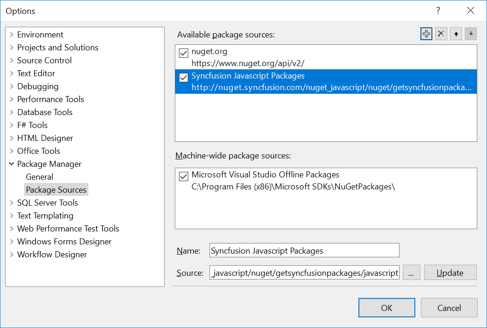
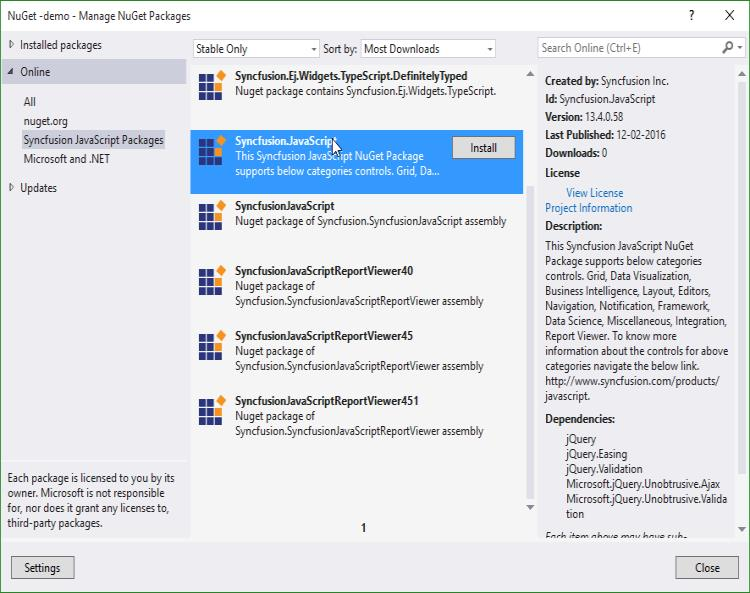
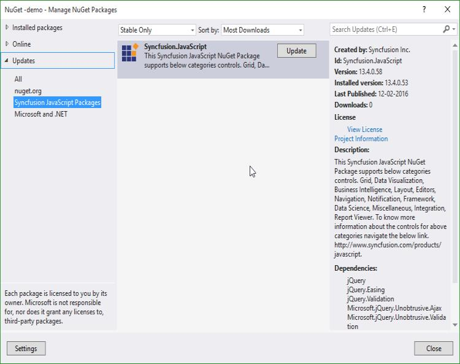

# Installation & Deployment

## For Windows Users

Download the setup file (.exe) of Essential Studio for JavaScript product from this [link](http://www.syncfusion.com/downloads/javascript) with your Syncfusion account and follow the steps mentioned in the [setup guide](http://help.syncfusion.com/common) to install the specific/entire platform on your machine.

### Install Location

The following root location contains all the Syncfusion assemblies, scripts, stylesheets and dashboard samples.

&lt;installed location&gt;\Syncfusion\Essential Studio\14.1.0.46\

        For example, whenyou have installed the Essential Studio package within C:\Program Files (x86), then navigate to the following location,

        C:\Program Files (x86)\Syncfusion\Essential Studio\14.1.0.46\

You can find the JavaScript mobile Samples from the Samples folder present within the above specified location that includes separate folders for both the web and mobile samples separately.

#### JavaScript Folder Structure & Asset Details

The following location is the root JavaScript folder that contains two important sub-folders,

* assets

* Src

&lt;installed location&gt;\Syncfusion\Essential Studio\14.1.0.46\ JavaScript\ 

        For example, when you have installed the Essential Studio package within C:\Program Files (x86), then navigate to the following location, 

        C:\Program Files (x86)\Syncfusion\Essential Studio\14.1.0.46\JavaScript\

#### assets

The assets folder comprises of all the minified versions of the external and common Scripts, Stylesheets and TypeScript files under their corresponding folders. It includes 4 sub-folders,

* CSS

* External

* Scripts

* TypeScript

* The stylesheets required for supporting the theming and styling of the Syncfusion components (both mobile and web) are available in a minified format within the CSS folder. The CSS folder is again sub-categorized into mobile and web where all the mobile related CSS files are present within the mobile folder and all those related to web components are availed within the web folder.

* The external folder contains the external dependency files such as jQuery, jQuery.easing, JsRender, Culture files and other third-party script files.

* The scripts folder includes all the Syncfusion components UI scripts in the minified format for both web and mobile components.

* The TypeScript folder includes the default type-definition file (ej.widgets.all.d.ts) for the purpose of supporting classes, modules, strong-type checking during compile time itself and also provides IntelliSense support within the JavaScript environment.

#### Src

This folder comprises of the sub-folder assets-src that includes all the non-minified versions of the Scripts and Stylesheets separately for all the individual Syncfusion widgets.

The same folders available within the assets folder such as, CSS, external, scripts, typescript are made available within the assets-src folder too, in the non-minified format that can be used for performing any customizations.

The location where these non-minified files are available is as follows,

    &lt;installed location&gt;\Syncfusion\Essential Studio\14.1.0.46\ JavaScript\Src\assets-src 

        For example, when you have installed the Essential Studio package within C:\Program Files (x86), then navigate to the following location, 

        C:\Program Files (x86)\Syncfusion\Essential Studio\14.1.0.46\JavaScript\Src\assets-src

## For MAC and Linux OS Users

For MAC OS and Linux users, a zip folder is provided instead of .exe file that includes the following main folders. (no installation required)

Assets – It contains all the Essential JavaScript scripts and CSS as mentioned previously.

External – It includes the external jQuery dependencies, culture files and other third-party scripts.

Samples – This folder contains samples of all the Syncfusion JavaScript controls. You can directly open the html sample page in any of the browser to view the output.

It also includes other folders such as, Release Notes, License Agreement and Read Me. The control creation is same as described in the Getting Started section. Here, the scripts and Stylesheets should be referred from the Assets folder into their respective HTML pages.

## Configuring Syncfusion NuGet Packages in Visual Studio

Syncfusion JavaScript NuGet packages are available [here](http://nuget.syncfusion.com/package/javascript).

### NuGet Configuration

The steps to install the Syncfusion JavaScript NuGet Packages in Visual Studio are as follows,

1. In Visual Studio, navigate to `Tools | NuGet Package Manager | Package Manager Settings`, the options dialog will appear on the screen as shows below,

2. Select `NuGet Package Manager | Package Sources` and click `Add` button to add the `Package Name` and `Package Source` of Syncfusion NuGet Packages.

Name: Name of the package that listed in Available package sources
Source: Syncfusion JavaScript NuGet Package feed URL[http://nuget.syncfusion.com/nuget_javascript/nuget/getsyncfusionpackages/javascript](http://nuget.syncfusion.com/nuget_javascript/nuget/getsyncfusionpackages/javascript)

N> The `Source` text box in the above image denotes the location of the NuGet packages and the `Name` section, allows you to provide a unique name for NuGet Packages Source.

IMPORTANT:

Syncfusion other platforms NuGet packages feed links are available [here](http://nuget.syncfusion.com/)

### NuGet Installation

Syncfusion JavaScript NuGet can install once configured the package source. The NuGet installation steps as below,

1. Once configured the Package source with Syncfusion NuGet Packages, right click on project and choose `Manage NuGet Packages | Online | &lt;Package Source Name&gt`;.

2. The NuGet Packages are listed which are available in package source location. Install the required packages to your application by clicking `Install` button.

N> NuGet packages can be install directly through the command line (Package Manager Console). Further details click [here](http://help.syncfusion.com/extension/syncfusion-nuget-packages/nuget-install-and-configuration)

### Updating a NuGet Package

Using the `Manage NuGet Packages` in Visual Studio, NuGet packages can be update.

1. Right click on Project and Navigate to the `Manage NuGet Packages` and click on the `Updates` tab to check for updates.

2. Select the `Updates -> &lt;Syncfusion Package Source&gt`;. Refer to the following screenshot for more information.

3. If there is a new version of NuGet you will see it in the list of available updates.

4. Select NuGet Package in the list and click `Update`. When the update is complete, close and re-open all open instances of Visual Studio.

N> By clicking `Update All` button, all NuGet packages are getting update. When the update is complete, close and re-open all open instances of Visual Studio.

