# Running the Application

## Windows OS

To run an application on a device and emulator, you need to configure IIS on your machine. The following are guidelines to configure IIS on a windows machine.

### Steps to configure IIS

1. Go to the Control Panel -> Programs -> Turn Windows Features on or off.

   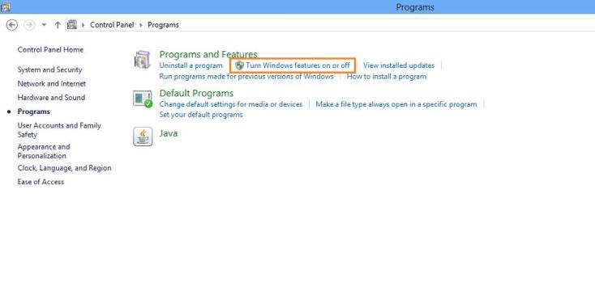

2. The Turn Windows features on or off dialog appears. Check all the features under Internet Information Services and Internet Information Services Hostable Web Core and click OK.

   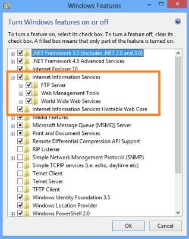

3. IIS starts installing. It takes a few minutes to install.

   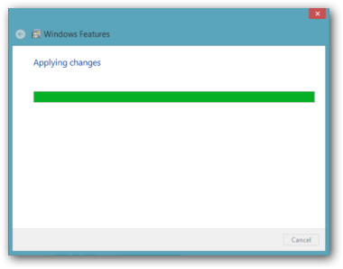

4. After installation, click finish, and continue with the following steps.

   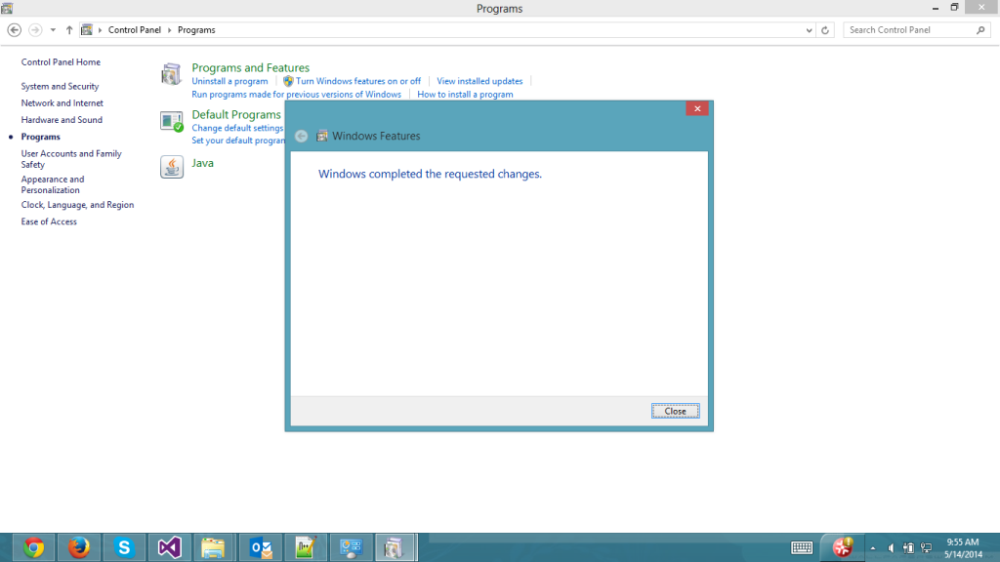

5. Go to the Control Panel->Administrative Tools-> Internet Information Services (IIS) Manager. IIS Manager appears as shown.

   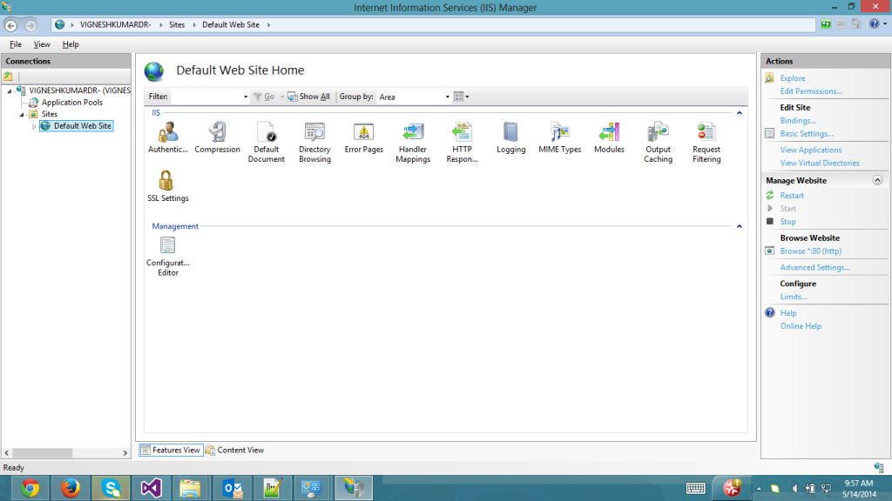

6. Right-click the Default Web Site and select Browse from the Manage Website.

   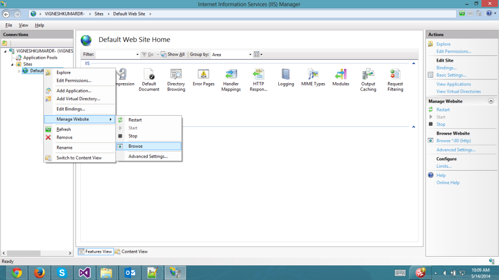

7. The following browser page appears when IIS is configured correctly.

   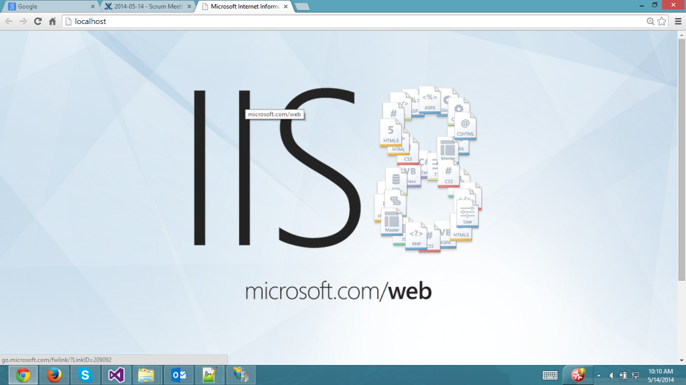

### Steps to Host an Application in IIS

1. To Host an Application in the IIS, right click the “Default Web Site” and Select Add Application.

   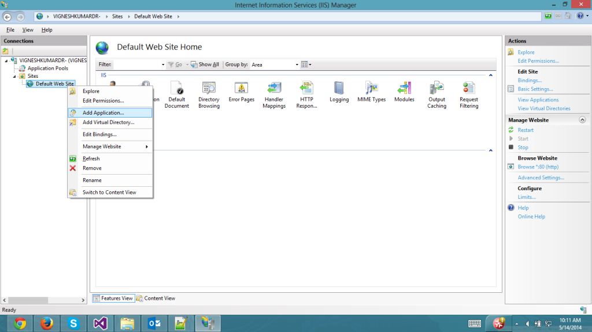

2. The Add application dialog appears as follows. Provide the path of the application and the Alias (the name given for the application for accessing by URL). The Alias is provided as “MobileApp” as shown in the following screenshot.

   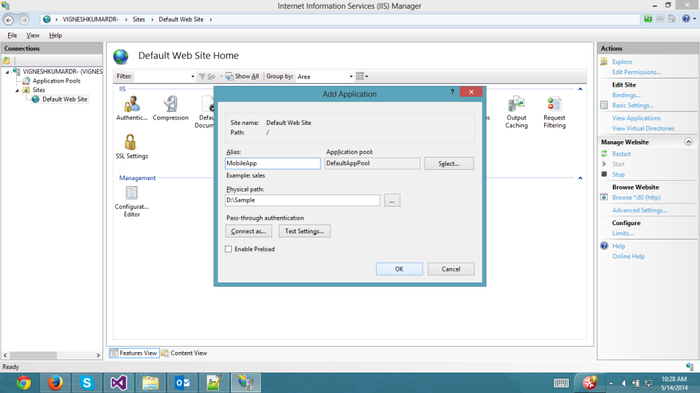

3. The application gets added to the Default Web Site. You can open the sample in the browser by using the following URL: [http://localhost/MobileApp/<samplename>.html](http://localhost/MobileApp/%3csamplename%3e.html)

### Enabling IIS port in Firewall

To enable the IIS port to access the hosted webpage from outside the hosted machine, follow the instructions:

1. Go to the control panel -> Windows Firewall -> Advanced Settings, and the following dialog appears.

   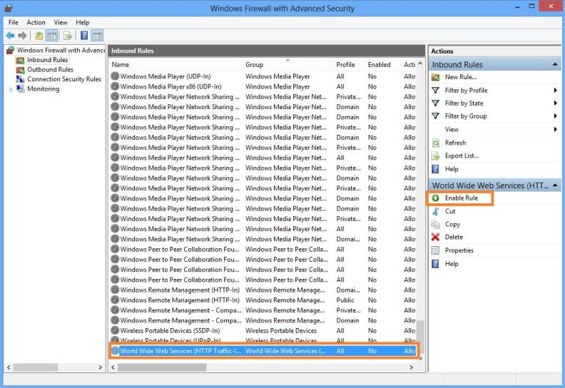

2. Select World Wide Web Services and click Enable Rule as shown in the above screenshot. This allows the HTTP traffic from outside the host.

### Running in Browser

To open the Web page on a browser, open the desired browser and type in the following URL to view the page: [http://localhost/MobileApp/<samplename>.html](http://localhost/MobileApp/%3csamplename%3e.html)

### Running Device

1. To access this Webpage from your mobile/tablet device, make sure that the following prerequisites are met:
   * The IIS port is open to firewall. Type the following URL on the mobile/tablet device. (Refer to: Enabling IIS port in Firewall section for more details).
   * The Mobile device and the IIS hosted Machine must be connected to the same network for IIS to work.

2. Type the following URL on the mobile/tablet: [http://ipaddress/MobileApp/<samplename>.html](http://ipaddress/MobileApp/%3csamplename%3e.html)

### Device emulation in the browser

You can emulate Mobile application in Chrome browser to know how its look varies for different devices. Follow the steps to emulate Mobile Application in Chrome.

1. Host your Mobile application in the IIIS as mentioned above.

2. Load your hosted URL in the Chrome browser. Now, you can see Mobile Application opened with browser configurations as follows.

   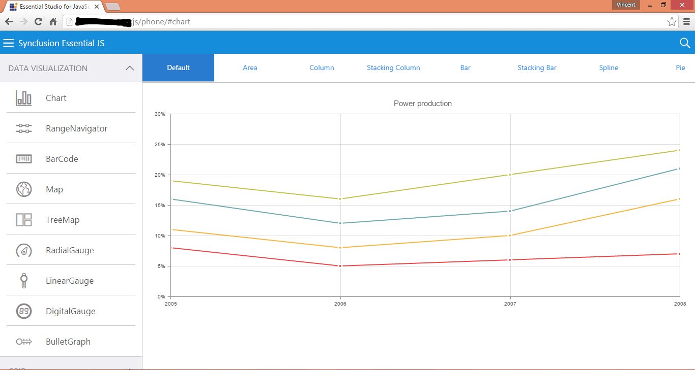

   Mobile Application
   {:.caption}
   
3. To emulate any device mode, click the Toggle device mode icon ()
   in the developer options window. Now, you can see the following window.

4. You can change the emulation mode to different devices by selecting different devices from the device dropdown. Refer to the following screenshot. Various devices are provided as options in the Chrome browser.

   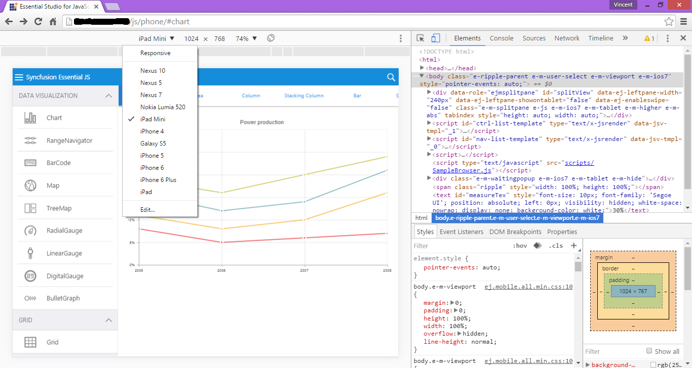

   Chrome
   {:.caption}

5. You can select different devices from the dropdown list to emulate mobile applications. Refer to the following screenshots where mobile applications are
   emulated in different modes (iPhone 5, Nexus 5, and Lumia 520).

   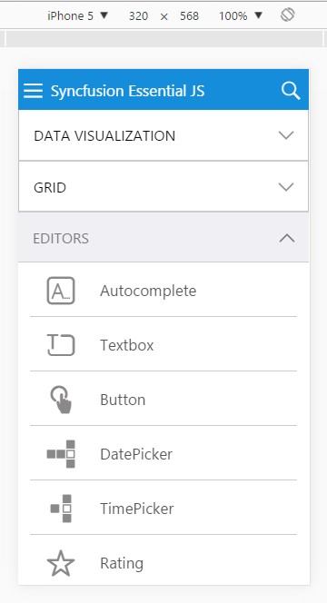

   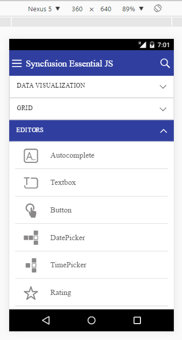

   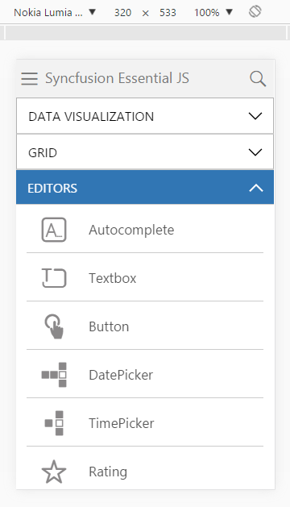

   Lumia 520
   {:.caption}

By clicking the Toggle device mode icon ()
again, you can get back from device emulation.

## Mac OS

To run the samples in Mac OS, you need to configure the Apache server as mentioned in the following steps.

### How to configure Apache web server in Mac OS X 

The Apache web server remains bundled with Mac OS X. So, you need to turn the command line to enable the web server. Additionally, you have to edit the user configuration file for each user account on Mac to have the personal web sharing feature active.

### Setting up and starting Apache web server in OS X:

Version of the OS X prior to mountain lion and mavericks can turn on “web sharing”. But, from 10.8 and 10.9 onwards, the following steps need done to use a local web server.

1. Launch Terminal, located/Application/Utilities.
2. Type the following command and replace the USERNAME with user account short name: Nano /etc/apache2/users/USERNAME.conf
3. Enter the admin password when requested, and then paste the following into the nano text editor.

   <Directory “/Users/USERNAME/Sites/”>

   Options  Indexes Multiviews

   AllowOverride AuthConfig Limit

   Order allow, deny

   Allow from all

   </Directory>

4. Edit the Directory path USERNAME to an appropriate username.
5. Do not click Control+O to save the changes to USERNAME.conf. Click Control+X to quit.
6. Next, you can start the web server with the following command: sudo apachect1 start.
7. Launch the browser and navigate to [http://127.0.0.1](http://127.0.0.1) to verify whether the server is running. You will get an “It works!” message.

   Then visit the http://127.0.0.1/~USERNAME / to see all the contents stored in the user ~/Sites/directory/, and you can add an index.html file or any other to the directory, to serve it to the outside world or even just the LAN.

   You can also use [http://localhost](http://localhost), and can edit the host files to set a local domain to whatever you want, to create local test environment with another live domain

8. To stop apache server user, use the following command: sudo apachect1 stop.
9. To restart apache server, use the following command: sudo apachect1 restart. 

### Running in iOS simulator

1. Run iOS simulator by using open Xcode select Xcode Open Developer Tool  iOS Simulator.

   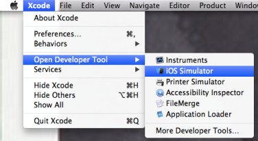

   iOS Simulator
   {:.caption}   

2. Open Safari application in the home page, and then enter the hosted application link.

   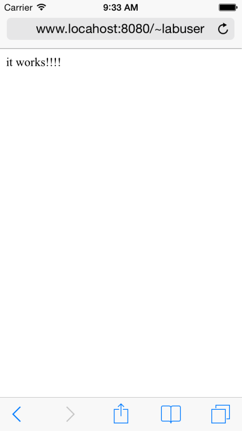

### Running in iOS Device:

1. Open the Safari application from iOS device home page.

2. Enter the hosted application URL.

   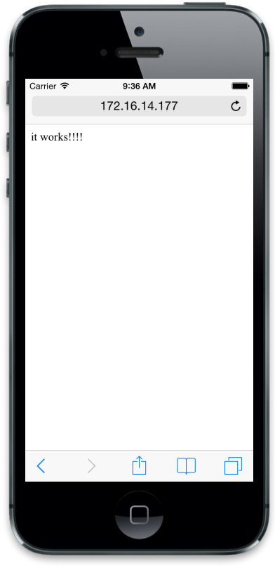