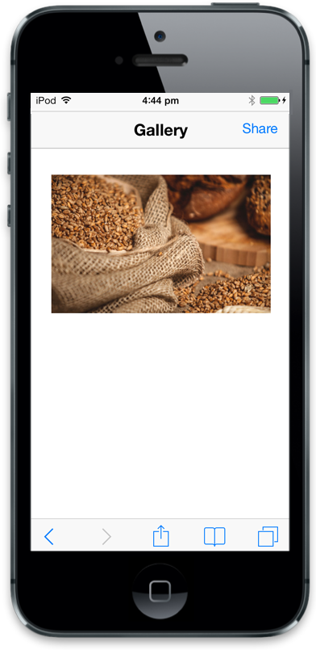
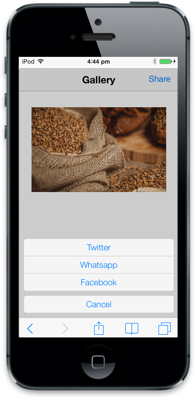
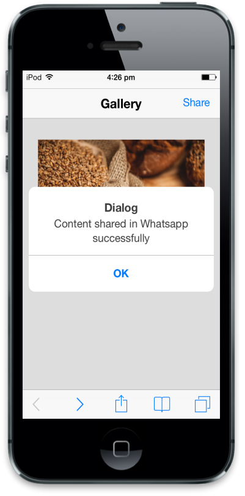

# Getting started

This section explains you on how to create a Menu using Essential JavaScript and how to use it in your application.

## Create your first Menu in JavaScript

The Essential JavaScript Mobile Menu provides an interface to easily navigate hierarchical data.  In the following example, you can learn to create a Gallery app and learn about the features in the Menu widget.

### Create the required layout for Gallery app

Essential JS Mobile Menu widget can be rendered from a hierarchy of <ul> and <li> and can perform unique actions based on the properties given for each <li> item. You can easily customize the Menu control by changing its properties. In the following code example, the gallery app menu is used to show multiple sharing options to share images.

Create an HTML file and paste the following template to the HTML file for Menu creation.



<!DOCTYPE html>

<html>

	<head>

		<title>Menu</title>

		<link href="http://cdn.syncfusion.com/{{ site.releaseversion }}/js/mobile/ej.mobile.all.min.css" rel="stylesheet" />

		                

		 

	</head>

	<body>

	        <div id="page" data-role="appview">

	        <!-- header control -->

	        <div data-role="ejmheader" id="menuitems" data-ej-position="normal" data-ej-title="Gallery" data-ej-showrightbutton="true" data-ej-rightbuttoncaption="Share">

	        

	        <div id="content">

	        

	        

	        <!--Add Menu Element here-->

	        

	        

	        

	        <!-- ScrollPanel -->

	 		<div data-role="ejmscrollpanel" data-ej-target="content">

	        

	</body>

</html>



Use the following styles for content.



.appview.e-m-windows.e-m-light {

	background: none repeat scroll 0 0 #eee;

}



Add the following code example to the <body> tag to display the gallery image and dialog control.



<!—Add Gallery image 

	

<!-- dialog control -->

	

	



Run the code and following screenshot is displayed.

## Create the Menu control

To render the menu control, set data-role attribute as ejmmenu to a 
 element. Menu can be displayed with or without a title. In this example, a title is not required, so set data-ej-ios7-showtitle attribute to false. By using the data-ej-text attribute, you can set text for menu items. Refer to the following code example.



<!-- Menu control -->

	<ul>

		<li data-ej-text="Twitter"></li>

		<li data-ej-text="Whatsapp"></li>

		<li data-ej-text="Facebook"></li>

	</ul>

 



## Show the Menu

To show the menu control, click the target element. Add data-ej-target attribute as a target element’s ID. You can use header right button as a target.

Refer to the following code example. 



<!-- Menu control -->

	<ul>

		<li data-ej-text="Twitter"></li>

		<li data-ej-text="Whatsapp"></li>

		<li data-ej-text="Facebook"></li>

	</ul>

          



Run this code and the following output is displayed. 

## Handle Menu events

You can add functionalities for each Menu item by using its touchend handler by setting the data-ej-touchend attribute. When you click a particular menu item, its corresponding touchend event is triggered and it can be handled as shown in the following code example.



 <!-- Menu control -->

	<ul>

		<li data-ej-text="Twitter"></li>

		<li data-ej-text="Whatsapp"></li>

		<li data-ej-text="Facebook"></li>

	</ul>

 



Add the following code example.



//object declaration

$(document).ready(function () {

	window.menuObject = $("#menuitem").data("ejmMenu"); // create object for menu.

	window.dialogObject = $("#alertdlg").data("ejmDialog"); // create object for dialog.

	if (ej.isWindows() && ej.isMobile())

		$("#menuitem").ejmMenu("model.theme", "light");

});

//handling menu action 
        //to show Dialog

function showDialog(args) {

   var text = args.text; //to get menu item text

   $("#dialogContent").append("Content shared in " + text + " successfully"); // add content to dialog

   window.menuObject.hide(); // to hide menu

   window.dialogObject.open(); //to open dialog

}

//to close dialog

function alertClose(args) {

   $("#dialogContent").empty(); //to empty the dialog content

   window.dialogObject.close(); //to close dialog

}



Run the code and the following output is displayed. 

