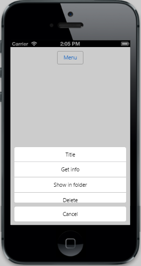

# Scrolling 	

The data-ej-allowscrolling attribute defines whether to allow the scrolling behavior or not when the number of Menu items exceed the specified Menu height.The default value of allowscrolling  property  is true



 

	<input id="menuitem" type="button" data-role="ejmbutton" data-ej-text="Menu" />

	<ul>

		<li data-ej-text="Get info"></li>

		<li data-ej-text="Show in folder"></li>

		<li data-ej-text="Delete"></li>

		<li data-ej-text="Get info"></li>

		<li data-ej-text="Show in folder"></li>

		<li data-ej-text="Delete"></li>

		<li data-ej-text="Get info"></li>

		<li data-ej-text="Show in folder"></li>

		<li data-ej-text="Delete"></li>

	</ul>



The following screenshot displays Scrolling:

