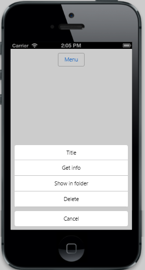

# Show Menu 

The Menu is shown by tap or taphold action on the target element and by setting the target element in data-ej-target attribute. Set the data-ej-showon attribute to specify the event after which the Menu is shown. By updating the desired event, the Menu shows when that particular event happens on the target element. Refer to the following code example. Here button is the target control (element). So its target ID (“menutarget”) is mentioned in the data-ej-target attribute. On clicking it, Menu control is displayed. 



	<input id="menutarget" type="button" data-role="ejmbutton" data-ej-text="Menu" />

	<ul>

		<li data-ej-text="Get info"></li>

		<li data-ej-text="Show in folder"></li>

		<li data-ej-text="Delete"></li>

	</ul>



The following screenshot displays the Show Menu:

