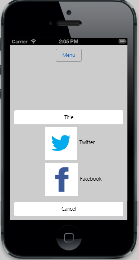

## Templating	

 You can customize the appearance of an individual Menu item or the whole Menu is rendered with a single template.



	<input id="menuitem" type="button" data-role="ejmbutton" data-ej-text="Menu" />

	

	   
Twitter

	   
Facebook

	



The following screenshot displays the RenderTemplate of Menu.

## TemplateID

This attribute is used to define the Template ID for the Menu item. Template is defined outside and can be rendered by using its ID for Menu items. The template’s ID is set to the data-ej-templateid attribute for the Menu control so that the template renders along with the Menu. 



    <input id="menuitem" type="button" data-role="ejmbutton" data-ej-text="Menu" /> 
	

 

            <input id="menuitem" type="button" data-role="ejmbutton" data-ej-text="Menu" />
        

        

        

            <ul>
                <li>Get info</li>
                <li>Show in folder</li>
                <li>Delete</li>
            </ul>
        

