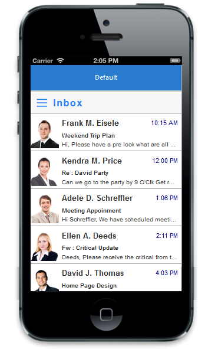
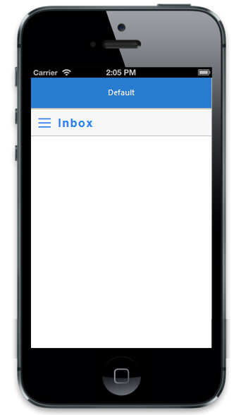

# Getting Started

## Create your first Toolbar in JavaScript

The Essential JavaScript mobile Toolbar provides a single interface to select a command from a collection of commands. It also provides template support. In this example, you can learn how to create a Mail App and through that you can learn the features of Mobile Toolbar Widget.

The Toolbar can also be Mentioned as NavigationBar,Header and Footer.

## Create the necessary layout

The Essential JavaScript Mobile Toolbar Widget is created by using number of <ul> and <li>. Each <li> item performs individual actions. You can customize the Toolbar control by changing its properties according to your requirement. In this scenario, a _back_ toolbar item is used to navigate to previous page, _next_ toolbar item to show the next email in the inbox, _compose_ toolbar item to compose new mail, delete toolbar item to delete current mail, and close toolbar item to close the inbox app. The following steps guide you in creating a basic Toolbar for your application.

Create an HTML file and add the following template to the html file for Toolbar creation.



<!DOCTYPE html>

<html>

	<head>

		<title>Toolbar</title>

		<link href="http://cdn.syncfusion.com/{{ site.releaseversion }}/js/mobile/ej.mobile.all.min.css" rel="stylesheet" />

		
		
		
		
	</head>

	<body>
		

      	  

      	  

       	 
   		

		
	</body>

</html>



Add the following code in your style section to use font icons in your sample,



	



Execute this code to render the following output.

### Adding ListView in NavigationBar

You can render required control in the NavigationBar. The below example shows you how to use ejmListView in slider panel.

Add following code in your html page,



	

        

        

        
        
        

    
    



Add the following code in your script section,



function _optionClick(e) {
            switch (e.data.text) {
            case "Inbox":
                $("#list").ejmListView("option", "dataSource", window.listData);
                break;
            case "Sent Item":
                $("#list").ejmListView("option", "dataSource", window.sentItemData);
                break;
            case "Outbox":
                $("#list").ejmListView("option", "dataSource", window.outboxData);
                break;
            }
            $("#mailHeadText").text(e.data.text);
            $("#defaultsplitpane").ejmSplitPane("closePane");
            $("#navContentScroll").ejmScrollPanel("scrollTo",0,0);
        }

        function onNavOpen() {
            $("#defaultsplitpane").ejmSplitPane("openLeftPane");

        }
	
	

	Some time if you don't want to refer entire css file, please refer the icons as individual by using the below code in style section,

	

	@font-face {
    font-family: 'ejmsbfonts';
    src: url('../themes/sbimages/ejmsbfonts.eot?rzt8lw');
    src: url('../themes/sbimages/ejmsbfonts.eot?rzt8lw#iefix') format('embedded-opentype'), url('../themes/sbimages/ejmsbfonts.ttf?rzt8lw') format('truetype'), url('../themes/sbimages/ejmsbfonts.woff?rzt8lw') format('woff'), url('../themes/sbimages/ejmsbfonts.svg?rzt8lw#ejmsbfonts') format('svg');
    font-weight: normal;
    font-style: normal;
    }
	
	.e-m-sbicon-drawermenu{
    font-family: 'ejmsbfonts' !important;
	}
	
   .e-m-sbicon-drawermenu:before {
    content: "\e93e";
    }

	

Execute the above mentioned code to get following output.

