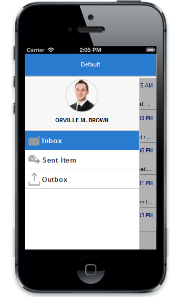

# Header templateid

data-ej-templateid is used to define the ID of the template element where you can specify the content to render in the control. The below code is used to rendered ejmlistview as template in the NavigationBar.



	

        

        

        
		



Execute the above mentioned code to get following output.

