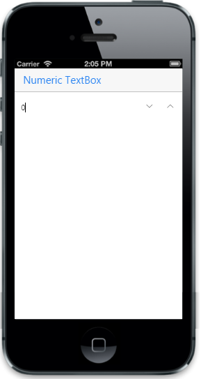

# Border support

Specifies the style of the border.The default value of the "borderStyle" is "box".

The border style is

* Box

* Line

* none



  

         <input id="sample" name="sample" data-role="ejmnumeric" type="number" data-ej-watermarktext="0" data-ej-borderstyle="none" />



The following screenshot displays the output.

