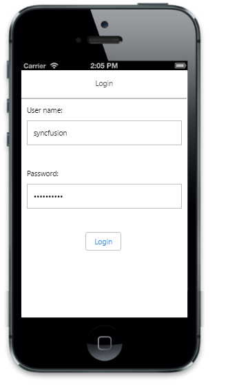
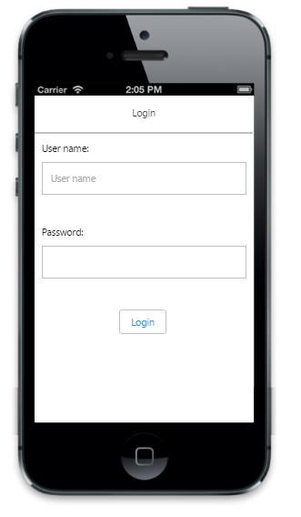
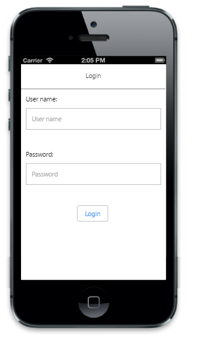

# Getting started

This section describes in brief how you can create an Essential JavaScript Mobile Password Textbox widget.

## Create your first Password Textbox in JavaScript

Using the given guidelines, you can create a basic login form using the Password Textbox control.

### Create Password Textbox

Create an HTML file and add the following template to the HTML file.



<!DOCTYPE html>

<html>

	<head>

		<title>Password</title>

		<meta name="viewport" content="width=device-width, initial-scale=1.0,maximum-scale=1.0, user-scalable=no" />

		<link href="http://cdn.syncfusion.com/{{ site.releaseversion }}/js/mobile/ej.mobile.all.min.css" rel="stylesheet" />

		

		

	</head>

	<body>

	

		

			

				<form id="loginForm">

					<label>

						User Name

					</label>

					

						<input id="userName" name="userName" data-role="ejmtextbox" data-ej-watermarktext="User Name" />                    

					

					<label>

						Password

					</label>

					<!-- Add Password elements here -->

					

						<input id="submit" name="submit" data-role="ejmbutton" data-ej-text="Login" type="button" />

					

				</form>

			

		

		

	</body>

</html>



To render the Password control, you can set “ejmpassword” to the data-role attribute for the specific input element as follows.                                   



<!-- Password elements -->

	<input name="password" id="password" data-role="ejmpassword" />



 Add the following styles to show the Password control in an order.



.error {

	color: red;

}

.sample {

	display: table;

	width: 100%;

}

.submit {

	text-align: center;

}

form {

	padding: 15px;

}

.container {

	display: table-cell;

	vertical-align: middle;

}



Run the above code example and you can see the following output.

## Set watermark text

The watermark text is usually a short hint that describes the expected value of the input field. This can be achieved by using the “data-ej-watermarktext” attribute.



<input name="password" id="password" data-role="ejmpassword" data-ej-watermarktext="Password" />



Run the above code example and you can see the following output.

