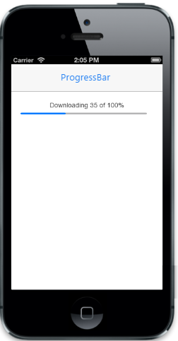

# Customize percentage

The data-ej-percentage attribute is used to specify the ProgressBar value in percentage that depends on maximum value. You can refer to the following code examples.  





Output of Percentage:

