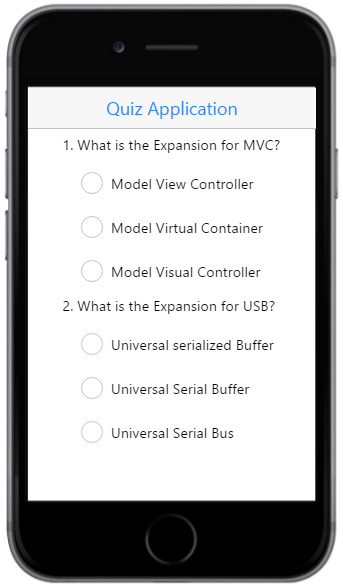

# Getting Started

This section briefly describes on how to create a QuizApp by using the Essential JavaScript Mobile RadioButton control and the features available in it.

The following guidelines shows how to use the RadioButton to select the answers in an application and to get the selected items. The following screenshot displays a sample Quiz application.

## Create the necessary Layout

Create an HTML file and paste the following template to the HTML file for the RadioButton creation.



<!DOCTYPE html>
<html>
<head>
    <meta name="viewport" content="width=device-width, initial-scale=1.0,maximum-scale=1.0, user-scalable=no" />
    <title>RadioButton</title>
    <link href="[http://cdn.syncfusion.com/{{ site.releaseversion }}/js/mobile/ej.mobile.all.min.css](http://cdn.syncfusion.com/{{ site.releaseversion }}/js/mobile/ej.mobile.all.min.css)" rel="stylesheet" />
    
    
    
</head>
<body>
    

        <!-- Header control here-->
        

        

            

                <!--RadioButton content here-->
            

        

        <!-- ScrollPanel control here-->
        

    

</body>
</html>



## Create a RadioButton

To render the RadioButton control, set the `data-role` attribute to `ejmradiobutton` for an input element and type attribute as `radio`.

Add the following code example to render the radio buttons in the quiz application.



<!--RadioButton content-->
   <table border="0" cellpadding="5">
        <tr>
            <td>
                1. What is the Expansion for MVC?
            </td>
        </tr>
        <tr>
            <td class="align">
                <input id="Radio1" name="radbtn" type="radio" data-role="ejmradiobutton" />
                <label for="Radio1" class="e-m-input-label">Model View Controller</label>
            </td>
        </tr>
        <tr>
            <td class="align">
                <input id="Radio2" name="radbtn" type="radio" data-role="ejmradiobutton" />
                <label for="Radio2" class="e-m-input-label">Model Virtual Container</label>
            </td>
        </tr>
        <tr>
            <td class="align">
                <input id="Radio3" name="radbtn" type="radio" data-role="ejmradiobutton" data-ej-text="Model Visual Controller" />
                <label for="Radio3" class="e-m-input-label">Model Visual Controller</label>
            </td>
        </tr>
        <tr>
            <td>
                2. What is the Expansion for USB?
            </td>
        </tr>
        <tr>
            <td class="align">
                <input id="Radio4" name="USB" type="radio" data-role="ejmradiobutton" />
                <label for="Radio4" class="e-m-input-label">Universal serialized Buffer</label>
            </td>
        </tr>
        <tr>
            <td class="align">
                <input id="Radio5" name="USB" type="radio" data-role="ejmradiobutton" />
                <label for="Radio5" class="e-m-input-label">Universal Serial Buffer</label>
            </td>
        </tr>
        <tr>
            <td class="align">
                <input id="Radio6" name="USB" type="radio" data-role="ejmradiobutton" />
                <label for="Radio6" class="e-m-input-label">Universal Serial Bus</label>
            </td>
        </tr>
    </table>



Now, add the following styles to align the RadioButton and the other contents properly in the quiz application.





The following screenshot is the final output for the above code example.

