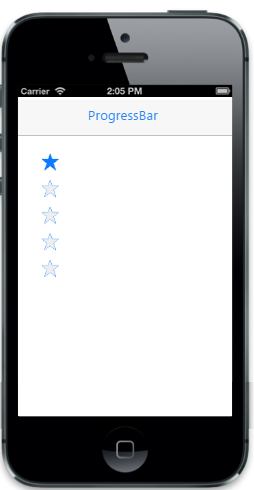

# Customize orientation

You can customize the orientation the rating using **data-ej-orientation** attribute . It can be,

1. Horizontal.
2. Vertical. 





The following screenshot displays the output.                        

