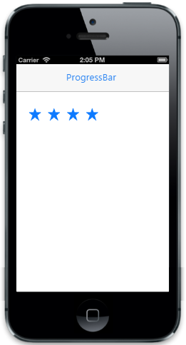

# Customize values

The "data-ej-maxvalue" attribute is used to denote the maximum value up to which the rating can be accepted. The data-ej-minvalue attribute is used to denote the minimum rating value. The "data-ej-value" attribute specifies the current selection value. The "data-ej-incrementstep" attribute specifies the step value incrementation between each rating value (star) selection.





The following screenshot displays the output.

