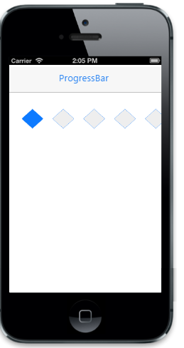

# Customize shape

The data-ej-shape attribute is used to specify the shape of the Rating. The possible values are,

1. Star
2. Circle
3. Diamond
4. Heart
5. Pentagon
6. Square
7. Triangle

The data-ej-shapeheight attribute specifies the height for the Rating shape. The data-ej-shapewidth attribute specifies the width of the Rating shape. The data-ej-spacebetweenshapes attribute specifies the space (padding) between each rating point (element).



    



The following screenshot displays the output.                        

