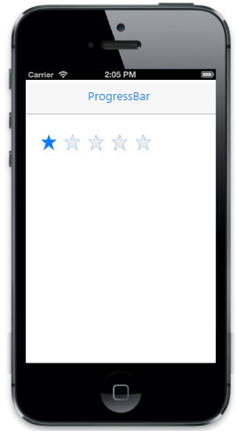

# Disable rating

The "data-ej-readonly" attribute is used to disable the interaction in the Rating control.The default value is false.



 



The following screenshot displays the output:                        

