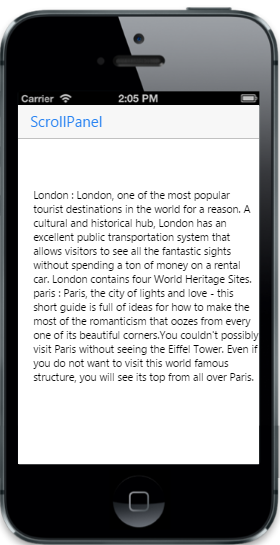

# Customize initial scrolling position	

The “data-ej-startx” and “data-ej-starty” attributes allow you to specify initial position of the scrolling content along x-axis and y-axis respectively. By default, these properties’ values are set to 0. Refer to the following code example.



	

		            London : London, one of the most popular tourist destinations in the world for a reason. A cultural and historical hub, London has an excellent public transportation system that allows visitors to see all the fantastic sights without spending a ton of money on a rental car.
				     London contains four World Heritage Sites.
            paris  : Paris, the city of lights and love - this short guide is full of ideas for how to make the most of the romanticism that oozes from every one of its beautiful corners.You couldn't possibly visit Paris without seeing the Eiffel Tower.
				     Even if you do not want to visit this world famous structure, you will see its top from all over Paris.

	



The following screenshot displays the ScrollPanel:

