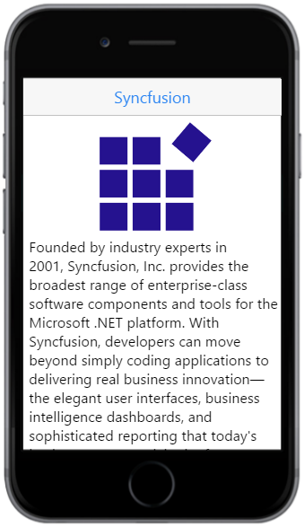
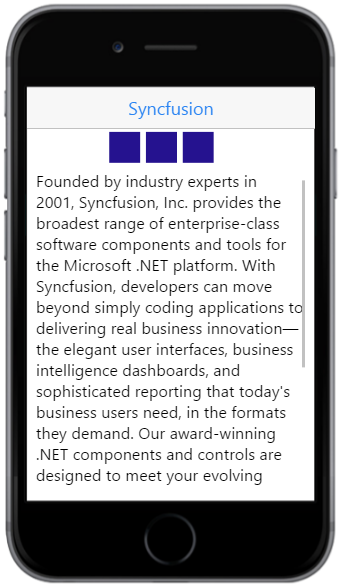

# Getting Started

The Scroll panel for mobile JavaScript is an interactive panel for scrolling. The Scroll panel control wraps its contents in a scrollable area as an object in a GUI with which continuous text, pictures can be scrolled and viewed even if it does not fit into the space of a mobile or computer display.

## Create the Scroll Panel

The following steps will guide you to add Scroll Panel for the required content area.

Create an HTML file and paste the following template to it.



<!DOCTYPE html>
<html>
<head>
    <title>Scroll Panel</title>
    <link href="[http://cdn.syncfusion.com/{{ site.releaseversion }}/js/mobile/ej.mobile.all.min.css](http://cdn.syncfusion.com/{{ site.releaseversion }}/js/mobile/ej.mobile.all.min.css)" rel="stylesheet" />
    
    
    
</head>
<body>
    <!-- header control -->
    

    <!-- Content that needs to be scrolled-->
    

        

            

            Founded by industry experts in 2001, Syncfusion, Inc. provides the broadest range of enterprise-class software components and tools for the Microsoft .NET platform. With Syncfusion, developers can move beyond simply coding applications to delivering real business innovation—the elegant user interfaces, business intelligence dashboards, and sophisticated reporting that today's business users need, in the formats they demand. Our award-winning .NET components and controls are designed to meet your evolving development needs, whether you're working in Windows Forms, WPF, ASP.NET, ASP.NET MVC, or Silverlight. At Syncfusion, we uncompromisingly strive for excellence in order to offer the very best value to our customers—from small ISVs to Fortune 100 companies. Our most successful product is Essential Studio. For more details about Essential Studio please click the below.
        

    

    <!-- Add scroll panel here-->
</body>
</html>



Add the following styles to display image and then align the content.





Run the above code which displays the following output.

## Adding Scroll Panel

To set Scroll Panel for a particular content, you need to specify the `data-role` attribute as `ejmscrollpanel` for a 
 element and set the `data-ej-target` attribute with a value which should match the `id` (“content” here) of the target element for which you need to add the Scroll Panel.





## Set the panel height and width	

The `data-ej-targetheight` and `data-ej-targetwidth` is used to set the height and width of the target panel respectively. When height or width of the content exceeds the height or width of target panel, then the content is set to scroll. 





The following output displays on running the above code.

## Enable horizontal and vertical ScrollPanel

The target content can be scrolled either vertically or horizontally or in both ways. The attribute `data-ej-enablevrscroll` enables vertical scrolling and the attribute `data-ej-enablehrscroll` enables horizontal scrolling.




