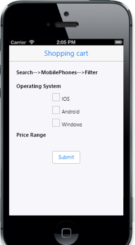

# Getting started 

**Essential JavaScript Mobile Slider** provides the selection of a single value or a range of values, using an interface with sliding handles.  The following example shows you how to create a **Shopping Cart App** and through that learn the features in the Slider widget.

 

## Create the layout for shopping cart app

**Essential JS Mobile Slider** widget is rendered by a 
 element with its required properties. You can customize Slider control by changing its properties according to your requirements. In the **Shopping Cart App **, the **Range Slider** is used to set the **price range**.

Create an **HTML** file and add the following template to the HTML file.



<!DOCTYPE html>
<html>
<head>
    <title>Slider</title>
    <link href="http://cdn.syncfusion.com/{{ site.releaseversion }}/js/mobile/ej.mobile.all.min.css" rel="stylesheet" />
    
    
</head>
<body>
    

        <!-- header control -->
        

        
	
        

            

                

                    

                        Search-->MobilePhones-->Filter
                    

                     
                    Operating System
                

                <!-- create check box for different OS  -->
                

                    <table border="0" cellpadding="6">
                        <tr>
                            <td>
                                <input id="ios" name="chkbox" data-role="ejmcheckbox" />IOS</td>
                            <td>
                        </tr>
                        <tr>
                            <td>
                                <input id="android" name="chkbox" data-role="ejmcheckbox" />Android</td>
                        </tr>
                        <tr>
                            <td>
                                <input id="windows" name="chkbox" data-role="ejmcheckbox" />Windows</td>
                            <td>
                        </tr>
                    </table>
                

                

                    Price Range
                

                
                
                

                 <!—Add Slider control here-->      
                

                

                    <input type="button" data-role="ejmbutton" data-ej-text="Submit" id="button" data-ej-touchend="ShowDialog" />
                

                <!-- dialog control -->
                

                    
Based on your suggestion the phones will displayed now     

                

            

        

        <!-- ScrollPanel -->
        

    

    
</body>
</html>



Execute the above code example to render the following output.

 

## Create Slider control

To render Slider control, set **ejmslider** to data-role attribute to 
 element. Set 100 as the minimum value for the Slider using data-ej-minvalue, and set 5000 as the maximum value using data-ej-maxvalue. Set data-ej-incrementstep to 100 so that the slider is moved for every 100 values. 



<!-- Slider control -->

 



Run the above code example to render the following output.

 

## Create the Range Slider

You can set the price range using Range Slider. Set **data-ej-enablerange** attribute to “True”. You can set the initial range values by using data-ej-values attribute. Here, you can set the values as [300, 1500]. The Slider’s left thumb is set to 300 and the right thumb is set to **1500**. 		

Add the following code to the **Slider 
**.
 


<!-- Slider control -->



Run the above code example to render the following output.

 

## Handle events

In this scenario, when you change the Slider value, the corresponding values are updated to the  element that acts as a label for Slider. You can use data-ej-slide event that is handled by appropriate function 		

Add the following code to the **Slider 
**.
 


<!-- Slider control -->



From the Slider’s getValue API, you can get the present value of both the Slider handles, anytime. Add the following code example to the <script> tag. 


//to display the slider value in span element (label) at initialize
        $(function (args) {
            window.dialogObject = $("#alertdlg").data("ejmDialog"); //to create dialog object
            window.sliderObject = $("#slider").data("ejmSlider"); //to create slider object
            setValue("300,1500");//set slider labels at initialize 
          });
        // handling slider slide event
        function processOnSlide() {
            var value = sliderObject.getValue();// get the value of slider by using getValue API
            setValue(value);
        }
        function setValue(value) {
            var position = value.split(",");
            $("#minvalue").html("$" + position[0]); //to set left thumb value to the left span
            $("#maxvalue").html("$" +position[1]); // to set right thumb value to the right span
        }
        }



Run the above code example to render the following output.

 

In this scenario, a dialog is displayed to provide information about the search when Submit is clicked. Add the following code to the  ** <script>** tag.


//to display the slider value in span element (label) at initialize
//to open dialog
        function ShowDialog(args) {
            dialogObject.open(); //to show dialog
        } 
        //to close dialog
        function alertClose(args) {
            dialogObject.close(); //close dialog
        }



Execute the above code example to render the following output, when you click Submit.

 