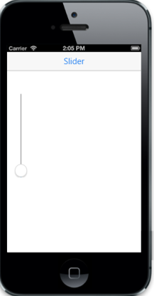

# Orientation

It specifies the Orientation  of the Slider. To change orientation, data-ej-orientation attribute is used. By default, the value is set to “horizontal”.

The possible values are,

1.	Horizontal
2.	Vertical



        
 



The following screenshot displays the Slider Orientation:

 

