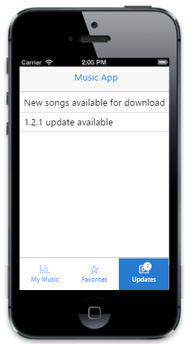
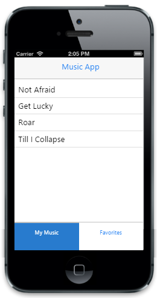
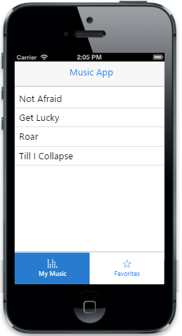
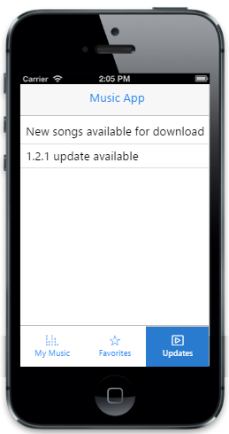

# Getting Started

The Essential JavaScript Mobile Tab provides a way to switch views within a web page. In the following section a Music App is created to explain the features of Mobile Tab widget. 

The above screenshot illustrates a Mobile Tab in which you can switch through different views from a single webpage and also load tabs on-demand by specifing the URL.

## Create Tabs for music app

The Essential JavaScript Mobile Tab widget can be rendered by specifying static content or by using on- demand contents by specifying the respective URL. In both the cases Tab control is rendered based on the default values of its properties. You can easily customize Tab control by changing their properties according to your requirement. In this Music App you require three tabs, one for displaying the available music, one for listing out the favorite tracks that you have marked and the other for displaying the updates on the music app. The following code example illustrates how to create a basic Tab for your application. 

Create an HTML file and paste the following template to the HTML file for creating Tab.



<!DOCTYPE html>

<html>
 <head>
     <title>Tab</title>
     <link href="http://cdn.syncfusion.com/{{ site.releaseversion }}/js/mobile/ej.mobile.all.min.css" rel="stylesheet" />
    
    
</head>
<body>

    

        

        

        

            

               <!--Add Tab Elements here. --> 

            

        
 

    

</body>

</html>



To add the scroll panel to a particular content, set the “data-role” attribute to “ejmscrollpanel” and also the value of “data-ej-target” attribute should match with the id of the element to which the scroll panel is added. Add the following code example to the layout to set scroll panel for the content.





To render the Tab control, set the “data-role” attribute to “ejmtab” to a 
 element and include the list of tab items that is added. Add the “data-ej-text” attribute to set text for each item.To add content for the Tab control, specify the “data-ej-href” to set the content that is loading on each tab and this attribute should match the “id” of the element in which you have specified the Tab content. In this application the Essential JS Mobile ListView control is used with ids “mymusic” and “favorites” that are specified in “data-ej-href” attribute to the respective items and you have a third tab that loads the content dynamically from a given URL. 

N> The third tab is discussed later in the “loading on demand content section”.



<!-- Tab control -->
 

            <!-- first Tab -->
 

        <ul id="mymusic" data-role="ejmlistview" style="margin-top:60px">
            <li data-ej-text="Not Afraid"></li>
            <li data-ej-text="Get Lucky"></li>
            <li data-ej-text="Roar"></li>
            <li data-ej-text="Till I Collapse"></li>
        </ul>
         <!-- second  Tab -->
        <ul id="favorites" data-role="ejmlistview">
            <li data-ej-text="Dark Horse"></li>
            <li data-ej-text="Roar"></li>
        </ul>
        <ul id="tabdefault" data-role="ejmtab" data-ej-contentid="tabdefault-container" data-ej-position="bottom">
            <li data-ej-href="#mymusic" data-ej-text='My Music'></li>
            <li data-ej-href="#favorites" data-ej-text='Favorites'></li>
        </ul>
        

        

    



Run the code example to render the output as follows. 

The above screenshot illustrates the Mobile Tab widget created for the Music App. 

## Add images to the Tabs

You have created the Tab that is required for your application. Now you can add images to your Tab. Add images to the Tab by specifying the data-ej-icon for individual items in the Tab. 

Use the following code sample to add images to your Tab.



        <ul id="tabdefault" data-role="ejmtab" data-ej-contentid="tabdefault-container" data-ej-position="bottom">
            <li data-ej-href="#mymusic"  data-ej-text='My Music' data-ej-icon="musicicon"></li>
            <li data-ej-href="#favorites" data-ej-icon="favourite" data-ej-text='Favorites'></li>
        </ul>



Run the code to render the following output.

The above screenshot illustrates the Tab control rendered with the tab images.

## Add on demand content for updates Tab

In some applications the content in Tab is loaded only when it is required, in this application the updates Tab are loaded only if you want to check for an update. For loading the content on-demand specify enableAjax property to true and specify the URL to load on demand for individual items in the tab.

Use the following code example to add the contents on-demand in the Tab.



        <ul id="tabdefault" data-role="ejmtab" data-ej-contentid="tabdefault-container" data-ej-position="bottom">
            <li data-ej-href="#mymusic" data-ej-text='My Music' data-ej-icon="musicicon"></li>
            <li data-ej-href="#favorites" data-ej-icon="favourite" data-ej-text='Favorites'></li>
            <li data-ej-icon="playmusic" data-ej-href="updates.html" data-ej-enableajax="true" data-ej-text='Updates'>
        </ul>



Create an HTML file with the title updates.html and add the following code sample to it.



 <ul>

     <li data-ej-text="New songs available for download"></li>

     <li data-ej-text="1.2.1 update available"></li>

 </ul>



Run the code example to render the following output. 

The above screenshot illustrates the Mobile Tab with the load on-demand property.

## Set badge value for updates Tab 

In the real time Music App, the number of available updates is viewed before you decide to view the Tab. For this set the “data-ej-badge-enabled” to true and set the desired badge value in the “data-ej-badge-value” attribute. 

Use the following code example to initialize the badge values.



        <ul id="tabdefault" data-role="ejmtab" data-ej-contentid="tabdefault-container" data-ej-position="bottom">
            <li data-ej-href="#mymusic" data-ej-text='My Music' data-ej-icon="musicicon"></li>
            <li data-ej-href="#favorites" data-ej-icon="favourite" data-ej-text='Favorites'></li>
            <li data-ej-icon="playmusic" data-ej-href="updates.html" data-ej-enableajax="true" data-ej-text='Updates' data-ej-badge-value="2">
        </ul>


Run the above code example to render the following output. 

