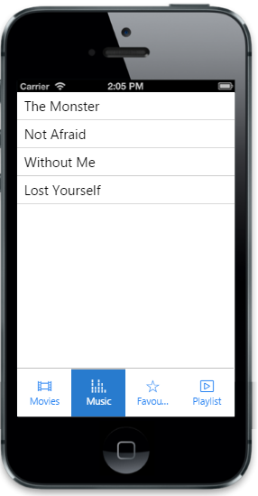

# Select item

Tab control takes a numeric value given in “data-ej-selecteditemindex” attribute and selects the corresponding item that matches the given index. Default value for selectedItemIndex property is set to 0. You can refer the following code example.



	<ul>

		<li data-ej-href="#mymusic" data-ej-text='My Music' data-ej-ios7-imageclass="icn-Mymusic"></li>

		<li data-ej-href="#favorites" data-ej-text='Favorites' data-ej-ios7-imageclass="icn-Favorites"></li>

		<li data-ej-href="#updates" data-ej-text='Updates' data-ej-ios7-imageclass="icn-Updates"></li>

	</ul>

<!-- Tab first item -->

    <ul>

        <li data-ej-text="Not Afraid"></li>

        <li data-ej-text="Get Lucky"></li>

        <li data-ej-text="Roar"></li>

        <li data-ej-text="Till I Collapse"></li>

    </ul>

<!-- Tab second item -->

    <ul>

        <li data-ej-text="Dark Horse"></li>

        <li data-ej-text="Roar"></li>

    </ul>

<!-- Tab third item -->

 <ul>

     <li data-ej-text="New songs available for download"></li>

     <li data-ej-text="1.2.1 update available"></li>

 </ul>



The following screenshot displays the Selected Items:

