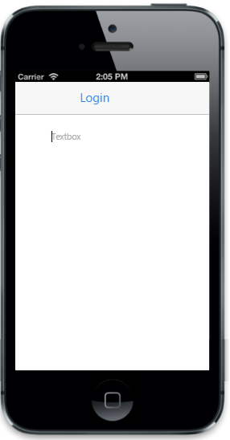

# Border Style

The 'BorderStyle' property is used to decide the style of the border.

Refer to the following code example.



<input id="textbox_sample" data-role="ejmtextbox" data-ej-watermarktext="Textbox" data-ej-borderstyle="none" data-ej-width="200px">



The following screenshot displays the ShowBorder property.

