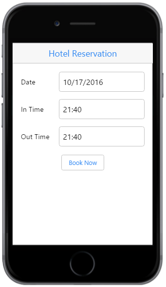
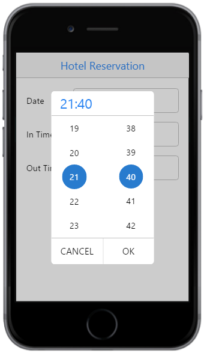
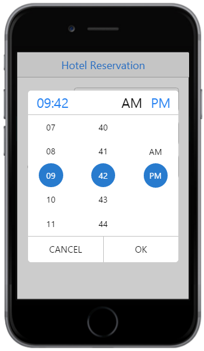
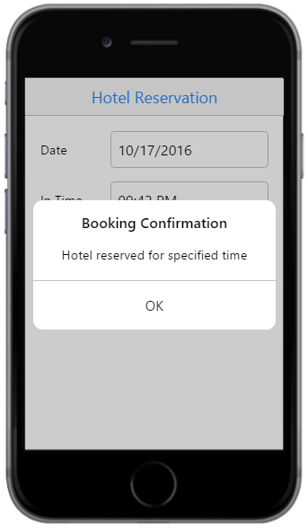

# Getting Started

The TimePicker widget displays a TimePicker in your web page and allows you to pick a time value from it. This section explains on how to customize two TimePickers for a real time hotel reservation scenario.

The below screenshot illustrates the usage of TimePickers in the hotel reservation scenario.

## Create the necessary Layout

Create an Essential JavaScript Mobile TimePicker widget easily by using a simple input element.

Create an HTML file and add the following code example to it.



<!DOCTYPE html>
<html>
<head>
    <title> TimePicker </title>
    <meta id="viewport" name="viewport" content="width=device-width, initial-scale=1.0,maximum-scale=1.0, user-scalable=no" />
    <link href="[http://cdn.syncfusion.com/{{ site.releaseversion }}/js/mobile/ej.mobile.all.min.css](http://cdn.syncfusion.com/{{ site.releaseversion }}/js/mobile/ej.mobile.all.min.css)" rel="stylesheet" />
    
    
    
</head>
<body>
    <!-- header control -->
    

    

        <table>
            <tr>
                <td class="tdclass">Date</td>
                <td class="innerclass">
                    
                        <!-- create datepicker to select booking date -->
                        <input id="entryDate" data-role="ejmdatepicker" />
                    
                </td>
            </tr>
            <tr>
                <td class="tdclass">In Time</td>
                <td class="innerclass">
                    
                        <!-- Add InTime Timepicker element here -->
                    
                </td>
            </tr>
            <tr>
                <td class="tdclass">Out Time </td>
                <td class="innerclass">
                    
                        <!-- OutTime Timepicker element -->
                    
                </td>
            </tr>
        </table>
        <!-- button to confirm the reservation -->
        <input type="button" data-role="ejmbutton" data-ej-text="Book Now" data-ej-rendermode="auto" id="btnbook" data-ej-touchend="displayConfirmation" />
    

</body>
</html>



Add the following styles to display the TimePicker’s input element.





## Create a TimePicker

To render the TimePicker control, set `data-role` attribute to `ejmtimepicker` to the specific input element as follows.



<!-- InTime Timepicker element -->
<input id="startTime" data-role="ejmtimepicker" />

<!-- OutTime Timepicker element -->
<input id="endTime" data-role="ejmtimepicker" />



Execute the above code example and focus on **InTime** or **OutTime** TimePicker element to render the following output.

## Set the hour format

The TimePicker widget supports both 12 hour and 24 hour time format. The default value is 24 hour format. In this application, the booking table opens for all time throughout the day. Refer to the following code example to set 12 hour format by using the `data-ej-hourformat` attribute. 



 <!-- InTime Timepicker element -->
<input id="startTime" data-ej-hourformat="twelve" data-role="ejmtimepicker"/>

  <!-- OutTime Timepicker element -->
<input id="endTime" data-ej-hourformat="twelve" data-role="ejmtimepicker"/>



Execute the above code example and focus on **InTime** or **OutTime** TimePicker element to render the following output.

Refer to the following code example to display a confirmation message on clicking the **Book Now** button handled by the button's touch end event.



    
Hotel reserved for specified time

		


Add the following code example





Execute the above code and click the **Book Now** button to display the confirmation message as illustrated in the following screenshot.

