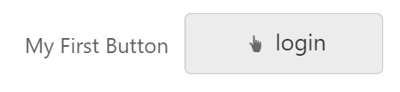

# Getting Started

This section explains briefly about how to create a **Button** in your application with JSP. The usage of **Button** control is described in the following sections.

## Create a simple Button in JSP
You can create an JSP application and add necessary scripts with the help of the given [JSP Getting Started Documentation.](/jsp-docs/jsp/Getting-Started)

Create the JSP file and add the below given code to render **Button** control.



    <table>
    <tr>
        <td>My First Button</td>
        <td><ej:button id="button" text="Login"></ej:button></td>
    </tr>
    </table>



## Configuring Button

This section encompasses the details on how you can configure the **Button** control in your application and customize it with various properties such as various size, rename the **Button**  according  to your requirement.
    
To modify the size of the **Button** and rename the **Button**, add the following code in your JSP file.


        
    <table>
    <tr>
        <td>My First Button</td>
        <td><ej:button id="button" text="Login" size="large" showRoundedCorner="true" contentType="textandimage" prefixIcon="e-icon e-handup"></ej:button></td>
    </tr>
    </table>

    


The following screenshot illustrates the **Button** control with text and size properties.   

  

