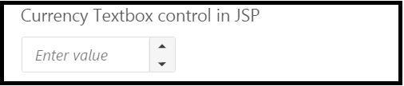
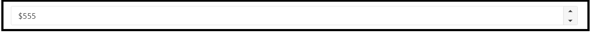

# Getting Started

This section explains briefly about how to create a **CurrencyTextbox** in your application with JSP.

The usage of **CurrencyTextbox** control is described in the following sections.

## Create a CurrencyTextbox in JSP
You can create an JSP application and add necessary scripts with the help of the given [JSP Getting Started Documentation](https://help.syncfusion.com/jsp/getting-started).

Create the JSP file and add the below given code to render **CurrencyTextbox** control.


      
CurrencyTextbox control in JSP

      <ej:currencyTextbox id="currency"></ej:currencyTextbox>
      


You can execute the above code example to display the **CurrencyTextbox** control.

 

## Configuring CurrencyTextbox
This section encompasses the details on how you can setting the **value**, **minValue** ,**width** properties with **CurrencyTextbox** control in your application according to your requirement.

To set the **value**, **minValue** ,**width** in your application add the following in your JSP file.



<ej:currencyTextbox id="defaultcurrency" value="555" width="100%"></ej:currencyTextbox>



Run the above code to display the **CurrencyTextbox** control with **value** and **minValue**.

 

