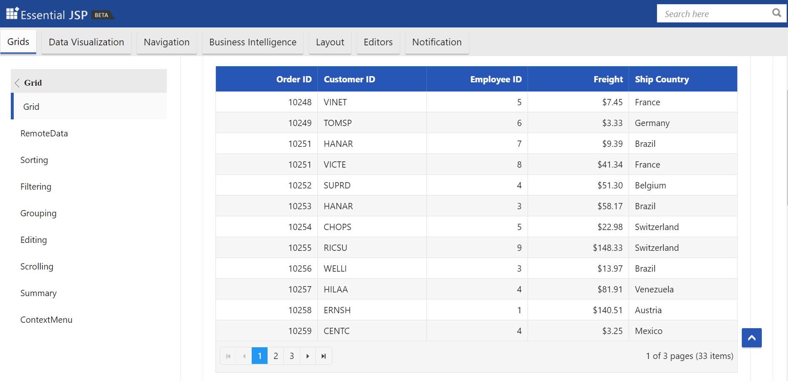
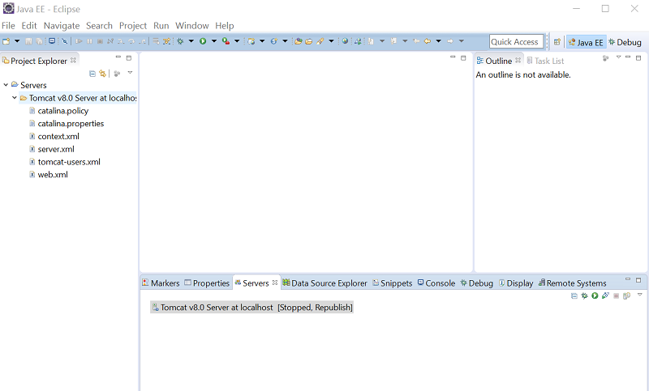
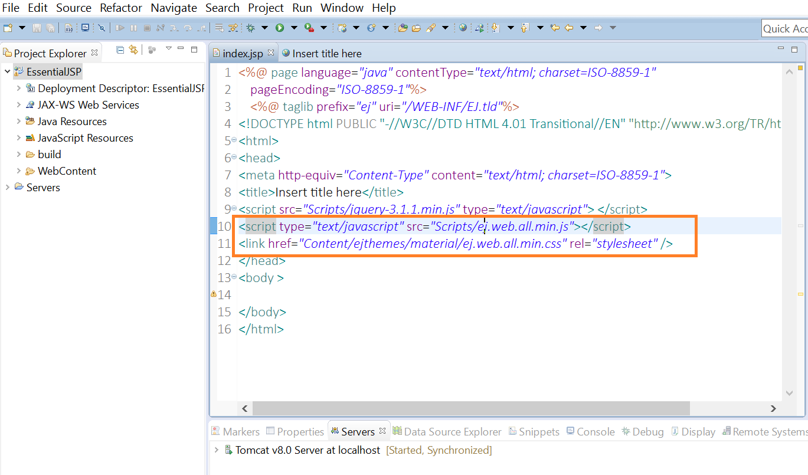
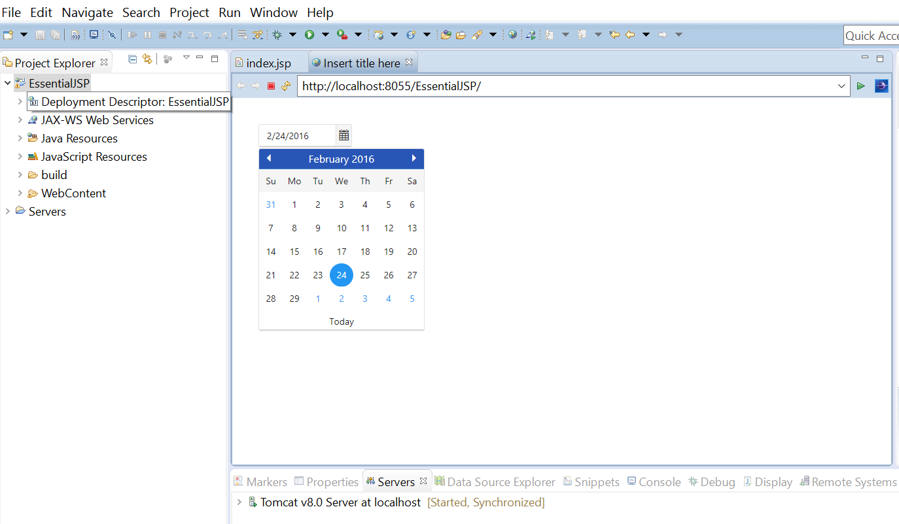

# Getting Started

## Essential JS for JSP

### Steps to deploy the Essential JS for JSP component demos in Apache Tomcat 

1.	Download the Apache Tomcat from the official download page
2.	You can find a sample JSP web site in the /Samples directory of the Essential JS for JSP distribution. To run the web site, copy this directory to your webapps folder of Apache Tomcat
3.	Run the startup.bat file from the Tomcat location (Tomcat bin folder)
4.	JSP SampleBrowser will be launched under the default port 8080 (localhost: 8080/SampleBrowser/index.jsp).
5.	Browse product samples using the Sample Browser.

### Steps to utilize Essential JS for JSP components in Dynamic web application with Eclipse environment

To use Essential JS for JSP in eclipse environment, follow the steps below:

1. Eclipse IDE with Apache Tomcat 7 configured 

  

2. Create a Dynamic web application in eclipse

   *	Choose File > New > Project....
   *	In the upcoming wizard choose Web > Dynamic Web Project.
   

  And create a new Dynamic web project in eclipse.

3. Add a new JSP page to your project’s.
   *	Right-click the WebContent folder. 
   *	Select New > JSP file. 
   *	Enter a file name and click Finish.

4. Copy Essential JavaScript and CSS files from /SampleBrowser/Scripts and /SampleBrowser/Content to your project’s /WebContent and Configure your JSP page to include the Essential JavaScript and CSS files to the page, as shown in the example below.

    <b>Example</b>

    

    <head>

    <link href="Content/ejthemes/material/ej.web.all.min.css" rel="stylesheet" />

    

    </head>

    

    

5. Now add the Essential JS for JSP source package from \SampleBrowser\WEB-INF\lib\syncfusion-taglib-[version].jar to your project's /WebContent/WEB-INF/lib folder.

6. Add the Custom taglib from \SampleBrowser\WEB-INF\EJ.tld to your project’s /WebContent/WEB-INF.
 
7. Import the Essential JS for JSP component package into your JSP page.

    <b>Example</b>

    

    <%@ page import="com.syncfusion.*"%>

    

8. Add the mapping Tag Library descriptor (tld) file to support Essential JS for JSP custom tags.

    <b>Example</b>

    

    <%@ taglib prefix="ej" uri="/WEB-INF/EJ.tld"%>

    

9. Use the Essential JS for JSP custom tag within your JSP file.

    <b>Example</b>

    

    <ej:datePicker id="datepicker”></ej:datePicker>

    

10. Finally, right-click your project’s in the Eclipse Project Explorer.

   * Select Run As > Run on server.
  

