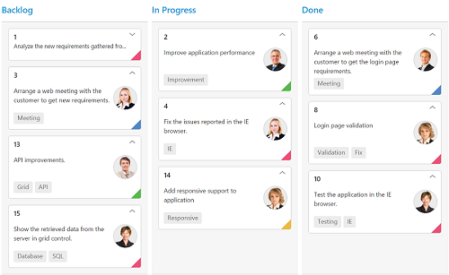
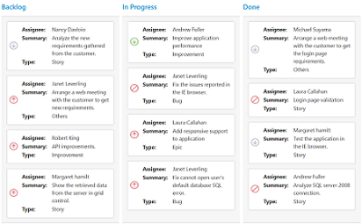
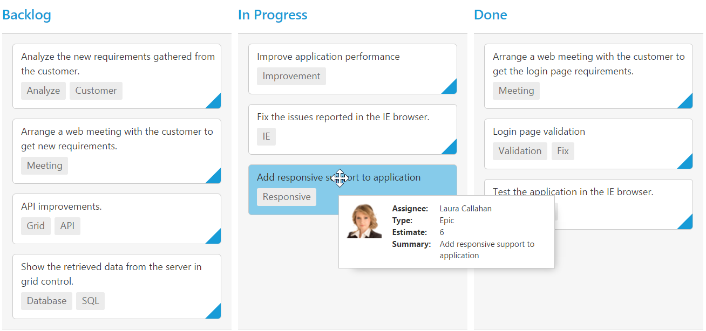

# Cards

## Customization

Cards can be customized with appropriate mapping fields from the database.

The following code example describes the above behavior.



    <%@ page language="java" contentType="text/html; charset=ISO-8859-1"
    pageEncoding="ISO-8859-1"%><%@ taglib prefix="ej" uri="/WEB-INF/EJ.tld" %><%@ page import="com.syncfusion.*" %><%@ page session="false" import="java.util.ArrayList" %><%@ page session="false" import="java.util.Iterator" %><%@ page session="false" import="java.util.HashMap" %><%@ page session="false" import="org.json.simple.parser.JSONParser" %><%@ page import="datasource.GetJsonData" %>
    <body>
	
<%
    GetJsonData obj=new GetJsonData();
    Object data = obj.GetKanbanJson();
    request.setAttribute("KanbanDataSource",data);
    JSONParser parser = new JSONParser();
    request.setAttribute("colorMap", parser.parse("{\"#ee4e75\": \"Bug,Story\",\"#57b94c\": \"Improvement\",\"#edba3c\": \"Epic\",\"#5187c6\": \"Others\"}"));
    %>
		<ej:kanban id="Kanban" keyField="Status" allowTitle="true" allowSelection="true" dataSource="${KanbanDataSource}">
			<ej:kanban-fields content="Summary" priority="RankId" tag="Tags" primaryKey="Id" imageUrl="ImgUrl" color="Type"></ej:kanban-fields>
			<ej:kanban-columns>
				<ej:kanban-column headerText="Backlog" key="Open"></ej:kanban-column>
				<ej:kanban-column headerText="In Progress" key="InProgress">
				</ej:kanban-column>
				<ej:kanban-column headerText="Done" key="Close"></ej:kanban-column>
			</ej:kanban-columns>
			<ej:kanban-cardSettings colorMapping="${colorMap}"></ej:kanban-cardSettings>
		</ej:kanban>
	

    </body>
    </html>



The following output is displayed as a result of the above code example.

## Template

Templates are used to create custom card layout as per the user convenient. HTML templates can be specified in the `template` property of the `cardSettings` as an ID of the template’s HTML element.

The following code example describes the above behavior.



    <%@ page language="java" contentType="text/html; charset=ISO-8859-1"
    pageEncoding="ISO-8859-1"%><%@ taglib prefix="ej" uri="/WEB-INF/EJ.tld" %><%@ page import="com.syncfusion.*" %><%@ page session="false" import="java.util.ArrayList" %><%@ page session="false" import="java.util.Iterator" %><%@ page import="datasource.GetJsonData" %>
    <body>
    

        <%
        GetJsonData obj=new GetJsonData();
        Object data = obj.GetKanbanJson();
        request.setAttribute("KanbanDataSource",data);
        %>
        <ej:kanban id="Kanban" keyfield="Status" allowtitle="true" allowselection="true" datasource="${KanbanDataSource}">
            <ej:kanban-fields content="Summary" primarykey="Id" imageurl="ImgUrl"></ej:kanban-fields>
            <ej:kanban-columns>
                <ej:kanban-column headertext="Backlog" key="Open"></ej:kanban-column>
                <ej:kanban-column headertext="In Progress" key="InProgress"></ej:kanban-column>
                <ej:kanban-column headertext="Testing" key="Testing"></ej:kanban-column>
            </ej:kanban-columns>
            <ej:kanban-cardsettings template="#cardtemplate"></ej:kanban-cardsettings>
        </ej:kanban>
    

    </body>
    
    
    </html>



The following output is displayed as a result of the above code example.

## Tooltip

You can enable HTML tooltip for Kanban card elements by setting `enable` property as true in `tooltipSettings`.

The following code example describes the above behavior.



    <%@ page language="java" contentType="text/html; charset=ISO-8859-1"
    pageEncoding="ISO-8859-1"%><%@ taglib prefix="ej" uri="/WEB-INF/EJ.tld" %><%@ page import="com.syncfusion.*" %><%@ page session="false" import="java.util.ArrayList" %><%@ page session="false" import="java.util.Iterator" %><%@ page session="false" import="java.util.HashMap" %><%@ page session="false" import="org.json.simple.parser.JSONParser" %><%@ page import="datasource.GetJsonData" %>
    <body>
	
<%
    GetJsonData obj=new GetJsonData();
    Object data = obj.GetKanbanJson();
    request.setAttribute("KanbanDataSource",data);
    JSONParser parser = new JSONParser();
    %>
		<ej:kanban id="Kanban" keyField="Status" dataSource="${KanbanDataSource}">
			<ej:kanban-fields content="Summary"  tag="Tags" primaryKey="Id"></ej:kanban-fields>
			<ej:kanban-columns>
				<ej:kanban-column headerText="Backlog" key="Open"></ej:kanban-column>
				<ej:kanban-column headerText="In Progress" key="InProgress">
				</ej:kanban-column>
				<ej:kanban-column headerText="Done" key="Close"></ej:kanban-column>
			</ej:kanban-columns>
			<ej:kanban-tooltipSettings enable="true"></ej:kanban-tooltipSettings>
		</ej:kanban>
	

    </body>
    </html>


 
The following output is displayed as a result of the above code example.

### Template

By making use of template feature with tooltip, all the field names that are mapped from the `dataSource` can be accessed to define the `template` tooltip for card. The `tooltipSettings.enable` must be enabled first.

The following code example describes the tooltip template.



    <%@ page language="java" contentType="text/html; charset=ISO-8859-1"
    pageEncoding="ISO-8859-1"%><%@ taglib prefix="ej" uri="/WEB-INF/EJ.tld" %><%@ page import="com.syncfusion.*" %><%@ page session="false" import="java.util.ArrayList" %><%@ page session="false" import="java.util.Iterator" %><%@ page session="false" import="java.util.HashMap" %><%@ page session="false" import="org.json.simple.parser.JSONParser" %><%@ page import="datasource.GetJsonData" %>
    <body>
    

        <%
        GetJsonData obj=new GetJsonData();
        Object data = obj.GetKanbanJson();
        request.setAttribute("KanbanDataSource",data);
        JSONParser parser = new JSONParser();
        %>
        <ej:kanban id="Kanban" keyfield="Status" datasource="${KanbanDataSource}">
            <ej:kanban-fields content="Summary" tag="Tags" primarykey="Id"></ej:kanban-fields>
            <ej:kanban-columns>
                <ej:kanban-column headertext="Backlog" key="Open"></ej:kanban-column>
                <ej:kanban-column headertext="In Progress" key="InProgress">
                </ej:kanban-column>
                <ej:kanban-column headertext="Done" key="Close"></ej:kanban-column>
            </ej:kanban-columns>
            <ej:kanban-tooltipsettings template="#tooltipTemp" enable="true"></ej:kanban-tooltipsettings>
        </ej:kanban>
    

    </body>
    
    
    </html>



 
The following output is displayed as a result of the above code example.

