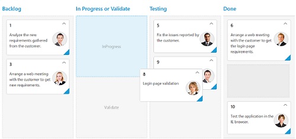
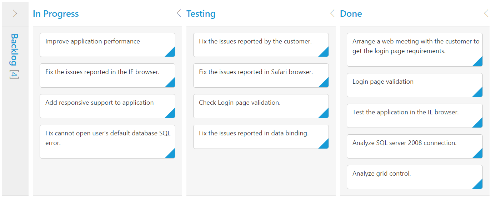

# Columns 

Column fields are present in the `dataSource` schema and it is rendering cards based its mapping column values.

## Key Mapping

To render Kanban with simple cards, you need to map the `dataSource` fields to Kanban cards and `columns`.

N> 1. If the column with `keyField` is not in the dataSource and `key` values specified will not available in column values, then the cards will not be rendered.
N> 2. If the `fields.content` is not in the dataSource, then empty cards will be rendered.

The following code example describes the above behavior.



    <%@ page language="java" contentType="text/html; charset=ISO-8859-1" pageEncoding="ISO-8859-1"%>
	<%@ taglib prefix="ej" uri="/WEB-INF/EJ.tld" %>
	<%@ page import="com.syncfusion.*" %><%@ page import="datasource.GetJsonData" %> 
    <body>
	
<%
    GetJsonData obj=new GetJsonData();
    Object data = obj.GetKanbanJson();
    request.setAttribute("KanbanDataSource",data);%>
    <ej:kanban id="Kanban" keyField="Status" dataSource="${KanbanDataSource}">
			<ej:kanban-fields content="Summary" primaryKey="Id"></ej:kanban-fields>
			<ej:kanban-columns>
				<ej:kanban-column headerText="Backlog" key="Open"></ej:kanban-column>
				<ej:kanban-column headerText="In Progress" key="InProgress"></ej:kanban-column>
				<ej:kanban-column headerText="Testing" key="Testing"></ej:kanban-column>
				<ej:kanban-column headerText="Done" key="Close"></ej:kanban-column>
			</ej:kanban-columns>
    </ej:kanban>
	

    </body>
    </html>
    


The following output is displayed as a result of the above code example.

## Multiple Key Mapping

You can map more than one datasource fields as `key` values to show different key cards into single column. For e.g , you can map "Validate,In progress" keys under "In progress" column. 

The following code example and screenshot which describes the above behavior.



    <%@ page language="java" contentType="text/html; charset=ISO-8859-1" pageEncoding="ISO-8859-1"%>
	<%@ taglib prefix="ej" uri="/WEB-INF/EJ.tld" %>
	<%@ page import="com.syncfusion.*" %><%@ page import="datasource.GetJsonData" %> 
    <body>
	
<%
    GetJsonData obj=new GetJsonData();
    Object data = obj.GetKanbanJson();
    request.setAttribute("KanbanDataSource",data);%>
    <ej:kanban id="Kanban" keyField="Status" allowTitle="true" dataSource="${KanbanDataSource}">
			<ej:kanban-fields content="Summary" primaryKey="Id"></ej:kanban-fields>
			<ej:kanban-columns>
				<ej:kanban-column headerText="Backlog" key="Open"></ej:kanban-column>
				<ej:kanban-column headerText="In Progress or Validate" key="InProgress,Validate"></ej:kanban-column>
				<ej:kanban-column headerText="Testing" key="Testing"></ej:kanban-column>
				<ej:kanban-column headerText="Done" key="Close"></ej:kanban-column>
			</ej:kanban-columns>
    </ej:kanban>
	

    </body>
    </html>



The following output is displayed as a result of the above code example.

## Headers

### Header Template

The template design that applies on for the column header. To render template, set `headerTemplate` property of the `columns`.

The following code example describes the above behavior.



    <%@ page language="java" contentType="text/html; charset=ISO-8859-1" pageEncoding="ISO-8859-1"%>
	<%@ taglib prefix="ej" uri="/WEB-INF/EJ.tld" %>
	<%@ page import="com.syncfusion.*" %><%@ page import="datasource.GetJsonData" %>
    <body>
    

        <%
        GetJsonData obj=new GetJsonData();
        Object data = obj.GetKanbanJson();
        request.setAttribute("KanbanDataSource",data);%>
        <ej:kanban id="Kanban" keyfield="Status" allowtitle="true" datasource="${KanbanDataSource}">
            <ej:kanban-fields content="Summary" primarykey="Id"></ej:kanban-fields>
            <ej:kanban-columns>
                <ej:kanban-column headertext="Backlog" key="Open" headertemplate="#column1"></ej:kanban-column>
                <ej:kanban-column headertext="In Progress" key="InProgress"></ej:kanban-column>
                <ej:kanban-column headertext="Testing" key="Testing"></ej:kanban-column>
                <ej:kanban-column headertext="Done" key="Close" headertemplate="#column4"></ej:kanban-column>
            </ej:kanban-columns>
        </ej:kanban>
    

    </body>
    
    
    

     Done
    

    </html>



The following output is displayed as a result of the above code example.

## Visibility 

You can hide particular column in Kanban by setting `visible` property of it as false.

The following code example describes the above behavior.



    <%@ page language="java" contentType="text/html; charset=ISO-8859-1" pageEncoding="ISO-8859-1"%>
	<%@ taglib prefix="ej" uri="/WEB-INF/EJ.tld" %>
	<%@ page import="com.syncfusion.*" %><%@ page import="datasource.GetJsonData" %> 
    <body>
	
<%
    GetJsonData obj=new GetJsonData();
    Object data = obj.GetKanbanJson();
    request.setAttribute("KanbanDataSource",data);%>
    <ej:kanban id="Kanban" keyField="Status" allowTitle="true" dataSource="${KanbanDataSource}">
			<ej:kanban-fields content="Summary" primaryKey="Id"></ej:kanban-fields>
			<ej:kanban-columns>
				<ej:kanban-column headerText="Backlog" key="Open"></ej:kanban-column>
				<ej:kanban-column headerText="In Progress" key="InProgress"></ej:kanban-column>
				<ej:kanban-column headerText="Testing" key="Testing" visible="false" ></ej:kanban-column>
				<ej:kanban-column headerText="Done" key="Close"></ej:kanban-column>
			</ej:kanban-columns>
    </ej:kanban>
	

    </body>
    </html>



The following output is displayed as a result of the above code example.

## Toggle 

You can set particular column collapsed state in Kanban by setting `isCollapsed` property of it as true. You need to set `allowToggleColumn` as true to use “Expand/Collapse” Column.

The following code example describes the above behavior.



    <%@ page language="java" contentType="text/html; charset=ISO-8859-1" pageEncoding="ISO-8859-1"%>
	<%@ taglib prefix="ej" uri="/WEB-INF/EJ.tld" %>
	<%@ page import="com.syncfusion.*" %><%@ page import="datasource.GetJsonData" %> 
    <body>
	
<%
    GetJsonData obj=new GetJsonData();
    Object data = obj.GetKanbanJson();
    request.setAttribute("KanbanDataSource",data);%>
    <ej:kanban id="Kanban" keyField="Status" allowToggleColumn="true" allowTitle="true" dataSource="${KanbanDataSource}">
			<ej:kanban-fields content="Summary" primaryKey="Id"></ej:kanban-fields>
			<ej:kanban-columns>
				<ej:kanban-column headerText="Backlog" key="Open" isCollapsed="true"></ej:kanban-column>
				<ej:kanban-column headerText="In Progress" key="InProgress"></ej:kanban-column>
				<ej:kanban-column headerText="Testing" key="Testing"></ej:kanban-column>
				<ej:kanban-column headerText="Done" key="Close"></ej:kanban-column>
			</ej:kanban-columns>
    </ej:kanban>
	

    </body>
    </html>



The following output is displayed as a result of the above code example.

## Allow Dragging

You can enable and disable drag behavior to the cards in the Kanban columns using the `allowDrag` property and the default value is `true`.

The following code example describes the above behavior.



    <%@ page language="java" contentType="text/html; charset=ISO-8859-1" pageEncoding="ISO-8859-1"%>
	<%@ taglib prefix="ej" uri="/WEB-INF/EJ.tld" %>
	<%@ page import="com.syncfusion.*" %><%@ page import="datasource.GetJsonData" %> 
    <body>
	
<%
    GetJsonData obj=new GetJsonData();
    Object data = obj.GetKanbanJson();
    request.setAttribute("KanbanDataSource",data);%>
    <ej:kanban id="Kanban" keyField="Status" dataSource="${KanbanDataSource}">
			<ej:kanban-fields content="Summary" primaryKey="Id" priority="RankId" ></ej:kanban-fields>
			<ej:kanban-columns>
				<ej:kanban-column headerText="Backlog" key="Open" allowDrag="false"></ej:kanban-column>
				<ej:kanban-column headerText="In Progress" key="InProgress"></ej:kanban-column>
				<ej:kanban-column headerText="Done" key="Close"></ej:kanban-column>
			</ej:kanban-columns>
    </ej:kanban>
	

    </body>
    </html>
    


The following output is displayed as a result of the above code example.

## Allow Dropping

You can enable and disable drop behavior to the cards in the Kanban columns using the `allowDrop` property and the default value is `true`.

The following code example describes the above behavior.



    <%@ page language="java" contentType="text/html; charset=ISO-8859-1" pageEncoding="ISO-8859-1"%>
	<%@ taglib prefix="ej" uri="/WEB-INF/EJ.tld" %>
	<%@ page import="com.syncfusion.*" %><%@ page import="datasource.GetJsonData" %> 
    <body>
	
<%
    GetJsonData obj=new GetJsonData();
    Object data = obj.GetKanbanJson();
    request.setAttribute("KanbanDataSource",data);%>
    <ej:kanban id="Kanban" keyField="Status" dataSource="${KanbanDataSource}">
			<ej:kanban-fields content="Summary" primaryKey="Id" priority="RankId" ></ej:kanban-fields>
			<ej:kanban-columns>
				<ej:kanban-column headerText="Backlog" key="Open"></ej:kanban-column>
				<ej:kanban-column headerText="In Progress" key="InProgress"></ej:kanban-column>
				<ej:kanban-column headerText="Done" key="Close" allowDrop="false"></ej:kanban-column>
			</ej:kanban-columns>
    </ej:kanban>
	

    </body>
    </html>
    


The following output is displayed as a result of the above code example.

##Items Count

You can show total cards count in each column's header using the property `enableTotalCount` and the default value is `false`.

The following code example describes the above behavior.



    <%@ page language="java" contentType="text/html; charset=ISO-8859-1" pageEncoding="ISO-8859-1"%>
	<%@ taglib prefix="ej" uri="/WEB-INF/EJ.tld" %>
	<%@ page import="com.syncfusion.*" %><%@ page import="datasource.GetJsonData" %> 
    <body>
	
<%
    GetJsonData obj=new GetJsonData();
    Object data = obj.GetKanbanJson();
    request.setAttribute("KanbanDataSource",data);%>
    <ej:kanban id="Kanban" keyField="Status" enableTotalCount="true" dataSource="${KanbanDataSource}">
			<ej:kanban-fields content="Summary" primaryKey="Id" priority="RankId" ></ej:kanban-fields>
			<ej:kanban-columns>
				<ej:kanban-column headerText="Backlog" key="Open"></ej:kanban-column>
				<ej:kanban-column headerText="In Progress" key="InProgress"></ej:kanban-column>
				<ej:kanban-column headerText="Done" key="Close"></ej:kanban-column>
			</ej:kanban-columns>
    </ej:kanban>
	

    </body>
    </html>
    


The following output is displayed as a result of the above code example.

