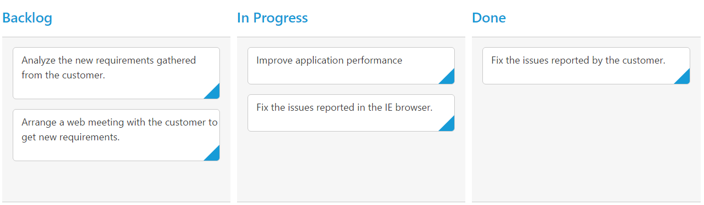
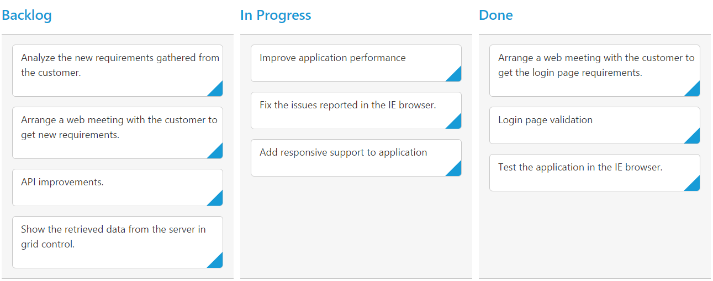

# Data Binding  

The Kanban control uses `ej.DataManager` which supports both RESTful JSON data services binding and local JSON array binding. The `dataSource` property can be assigned either with the instance of `ej.DataManager` or JSON data array collection. It supports different kinds of data binding methods such as

1.	Local data
2.	Remote data

## Local Data

To bind local data to the Kanban, you can assign a JSON array to the `dataSource` property.

The JSON array to the `dataSource` property can also be provided as an instance of the `ej.DataManager`. When the JSON array is passed as an instance of `ej.DataManager`, the `ej.JsonAdaptor` will be used to manipulate the Kanban data source.

The following code example describes the above behavior.



    <%@ page import="com.syncfusion.*" %>
    <%@ page session="false" import="java.util.ArrayList" %>
    <%@ page session="false" import="java.util.Iterator" %>
    <%@ page import="datasource.GetJsonData" %>
    <%@ page session="false" import="org.json.simple.parser.JSONParser" %>
     <%
     GetJsonData obj= new GetJsonData();
     Object data = obj.GetKanbanJson();
     ArrayList < Object > array = new ArrayList<Object>();
     JSONParser parser = new JSONParser();
     array.add(parser.parse("{\"Id\": \"1\",\"Status\": \"Open\",\"Summary\": \"Analyze the new requirements gathered from the customer.\",\"Type\": \"Story\",\"Priority\": \"Low\",\"Tags\": \"Analyze,Customer\",\"Assignee\": \"Andrew Fuller\"}"));
     array.add(parser.parse("{\"Id\": \"2\",\"Status\": \"InProgress\",\"Summary\": \"Improve application performance.\",\"Type\": \"Bug\",\"Priority\": \"Normal\",\"Tags\": \"Improvement\",\"Assignee\": \"Andrew Fuller\"}"));
     array.add(parser.parse("{\"Id\": \"3\",\"Status\": \"Close\",\"Summary\": \"Arrange a web meeting with the customer to get new requirements.\",\"Type\": \"Others\",\"Priority\": \"Critical\",\"Tags\": \"Meeting\",\"Assignee\": \"Janet Leverling\"}"));
     array.add(parser.parse("{\"Id\": \"4\",\"Status\": \"InProgress\",\"Summary\": \"Fix the issues reported in the IE browser.\",\"Type\": \"Story\",\"Priority\": \"Release Breaker\",\"Tags\": \"Analyze,Customer\",\"Assignee\": \"Janet Leverling\"}"));
     array.add(parser.parse("{\"Id\": \"5\",\"Status\": \"Close\",\"Summary\": \"Fix the issues reported by the customer.\",\"Type\": \"Bug\",\"Priority\": \"Low\",\"Tags\": \"Customer\",\"Assignee\": \"Andrew Fuller\"}"));
     request.setAttribute("KanbanDataSource", array);
     %>



Refer the below code to render kanban with datasource.



		<ej:kanban id="Kanban" keyField="Status" dataSource="${KanbanDataSource}">
			<ej:kanban-fields content="Summary" primaryKey="Id"></ej:kanban-fields>
			<ej:kanban-columns>
				<ej:kanban-column headerText="Backlog" key="Open"></ej:kanban-column>
				<ej:kanban-column headerText="In Progress" key="InProgress"></ej:kanban-column>
				<ej:kanban-column headerText="Done" key="Close"></ej:kanban-column>
			</ej:kanban-columns>
		</ej:kanban>



The following output is displayed as a result of the above code example.

## Remote Data

To bind remote data to Kanban Control, you can assign a service data as an instance of `ej.DataManager` to the `dataSource` property.

The following code example describes the above behavior.



    <%@ page language="java" contentType="text/html; charset=ISO-8859-1"
    pageEncoding="ISO-8859-1"%><%@ taglib prefix="ej" uri="/WEB-INF/EJ.tld" %><%@ page import="com.syncfusion.*" %><%@ page session="false" import="java.util.ArrayList" %><%@ page session="false" import="java.util.Iterator" %><%@ page import="datasource.GetJsonData" %>
    <body>
	
<%
    GetJsonData obj=new GetJsonData();
    Object data = obj.GetKanbanJson();
    request.setAttribute("DataSource",data);
    %>
		<ej:kanban id="Kanban" keyField="Status">
		<ej:dataManager url="http://js.syncfusion.com/demos/ejServices/Wcf/Northwind.svc/Tasks/"></ej:dataManager>
			<ej:kanban-fields content="Summary" primaryKey="Id"></ej:kanban-fields>
			<ej:kanban-columns>
				<ej:kanban-column headerText="Backlog" key="Open"></ej:kanban-column>
				<ej:kanban-column headerText="In Progress" key="InProgress"></ej:kanban-column>
				<ej:kanban-column headerText="Testing" key="Testing"></ej:kanban-column>
				<ej:kanban-column headerText="Done" key="Close"></ej:kanban-column>
			</ej:kanban-columns>
		</ej:kanban>
	

    </body>
    </html>



The following output is displayed as a result of the above code example.

