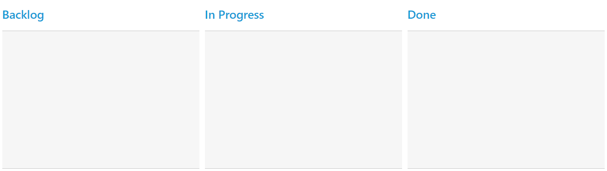
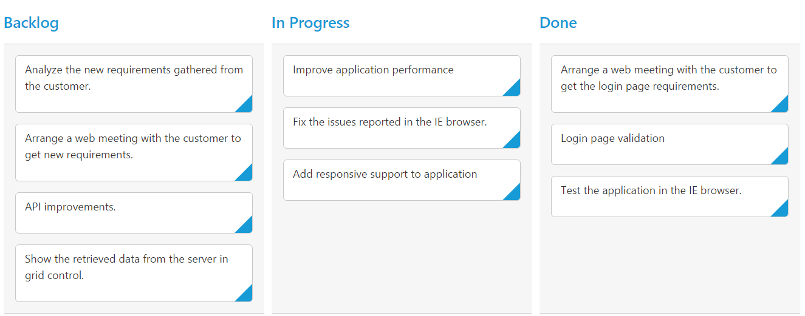
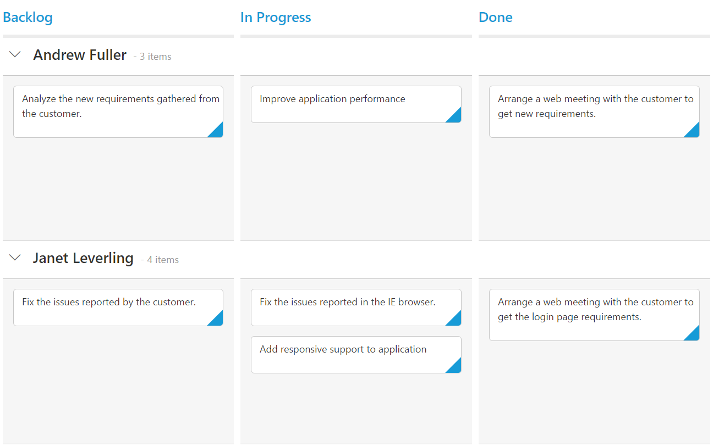

# Getting Started

This section explains you the steps required to populate the kanban with data. This section covers only the minimal features that you need to know to get started with the kanban.

## Preparing HTML document

## Create a Kanban

You can create an JSP application and add necessary scripts with the help of the given [JSP Getting Started Documentation.](/jsp/Getting-Started)



    <%@ page language="java" contentType="text/html; charset=ISO-8859-1" pageEncoding="ISO-8859-1"%>
	<%@ taglib prefix="ej" uri="/WEB-INF/EJ.tld" %>
	<%@ page import="com.syncfusion.*" %>
    <body>
	

		<ej:kanban id="Kanban">
			<ej:kanban-columns>
				<ej:kanban-column headerText="Backlog"></ej:kanban-column>
				<ej:kanban-column headerText="In Progress"></ej:kanban-column>
				<ej:kanban-column headerText="Done"></ej:kanban-column>
			</ej:kanban-columns>
		</ej:kanban>
	

    </body>
    </html>



## Data Binding

The data for kanban which can be populated using the dataSource property.

To configure data for kanban component, define an object array data. You need to import datasource in JSP sample and access the data in datasource by creating object of it. Refer the below code to define the datasource for the kanban.

Access the data from datasource by using below code,



    <%@ page import="com.syncfusion.*" %>
    <%@ page session="false" import="java.util.ArrayList" %>
    <%@ page session="false" import="java.util.Iterator" %>
    <%@ page import="datasource.GetJsonData" %>
    <%@ page session="false" import="org.json.simple.parser.JSONParser" %>
     <%
     GetJsonData obj= new GetJsonData();
     Object data = obj.GetKanbanJson();
     ArrayList < Object > array = new ArrayList<Object>();
     JSONParser parser = new JSONParser();
     array.add(parser.parse("{\"Id\": \"1\",\"Status\": \"Open\",\"Summary\": \"Analyze the new requirements gathered from the customer.\",\"Type\": \"Story\",\"Priority\": \"Low\",\"Tags\": \"Analyze,Customer\",\"Assignee\": \"Andrew Fuller\"}"));
     array.add(parser.parse("{\"Id\": \"2\",\"Status\": \"InProgress\",\"Summary\": \"Improve application performance.\",\"Type\": \"Bug\",\"Priority\": \"Normal\",\"Tags\": \"Improvement\",\"Assignee\": \"Andrew Fuller\"}"));
     array.add(parser.parse("{\"Id\": \"3\",\"Status\": \"Close\",\"Summary\": \"Arrange a web meeting with the customer to get new requirements.\",\"Type\": \"Others\",\"Priority\": \"Critical\",\"Tags\": \"Meeting\",\"Assignee\": \"Janet Leverling\"}"));
     array.add(parser.parse("{\"Id\": \"4\",\"Status\": \"InProgress\",\"Summary\": \"Fix the issues reported in the IE browser.\",\"Type\": \"Story\",\"Priority\": \"Release Breaker\",\"Tags\": \"Analyze,Customer\",\"Assignee\": \"Janet Leverling\"}"));
     array.add(parser.parse("{\"Id\": \"5\",\"Status\": \"Close\",\"Summary\": \"Fix the issues reported by the customer.\",\"Type\": \"Bug\",\"Priority\": \"Low\",\"Tags\": \"Customer\",\"Assignee\": \"Andrew Fuller\"}"));
     request.setAttribute("KanbanDataSource", array);
     %>



Refer the below code to render kanban with datasource.



		<ej:kanban id="Kanban" dataSource="${KanbanDataSource}">
			<ej:kanban-fields content="Summary" primaryKey="Id"></ej:kanban-fields>
			<ej:kanban-columns>
				<ej:kanban-column headerText="Backlog" key="Open"></ej:kanban-column>
				<ej:kanban-column headerText="In Progress" key="InProgress"></ej:kanban-column>
				<ej:kanban-column headerText="Done" key="Close"></ej:kanban-column>
			</ej:kanban-columns>
		</ej:kanban>



## Mapping Values

In order to display cards in Kanban control, you need to map the database fields to Kanban cards and columns. The required mapping field are listed as follows

* `keyField` - Map the column name to use as `key` values to columns.
* `columns` -  Map the corresponding `key` values of `keyField` column to each columns
* `fields.content` - Map the column name to use as content to cards.
* `fields.primaryKey` - Map the column name to use as primary Key.



    <%@ page language="java" contentType="text/html; charset=ISO-8859-1"
    pageEncoding="ISO-8859-1"%>
	<%@ taglib prefix="ej" uri="/WEB-INF/EJ.tld" %>
	<%@ page import="com.syncfusion.*" %>
	<%@ page session="false" import="java.util.ArrayList" %>
	<%@ page session="false" import="java.util.Iterator" %>
	<%@ page import="datasource.GetJsonData" %>
    <body>
	
<%
    GetJsonData obj=new GetJsonData();
    Object data = obj.GetKanbanJson();
    request.setAttribute("KanbanDataSource",data);
    %>
		<ej:kanban id="Kanban" keyField="Status" dataSource="${KanbanDataSource}">
			<ej:kanban-fields content="Summary" primaryKey="Id"></ej:kanban-fields>
			<ej:kanban-columns>
				<ej:kanban-column headerText="Backlog" key="Open"></ej:kanban-column>
				<ej:kanban-column headerText="In Progress" key="InProgress"></ej:kanban-column>
				<ej:kanban-column headerText="Done" key="Close"></ej:kanban-column>
			</ej:kanban-columns>
		</ej:kanban>
	

    </body>
    </html>

 

N>  `fields.primaryKey` field is mandatory for “Drag and Drop” ,”Selection” and “Editing” Features.

## Enable Swimlane

`Swimlane` can be enabled by mapping the `fields.swimlaneKey` to appropriate column name in `dataSource`. This enables the grouping of the cards based on the mapped column values.



    <%@ page language="java" contentType="text/html; charset=ISO-8859-1"
    pageEncoding="ISO-8859-1"%>
	<%@ taglib prefix="ej" uri="/WEB-INF/EJ.tld" %>
	<%@ page import="com.syncfusion.*" %>
	<%@ page session="false" import="java.util.ArrayList" %>
	<%@ page session="false" import="java.util.Iterator" %>
	<%@ page import="datasource.GetJsonData" %>
    <body>
	
<%
    GetJsonData obj=new GetJsonData();
    Object data = obj.GetKanbanJson();
    request.setAttribute("KanbanDataSource",data);
    %>
		<ej:kanban id="Kanban" keyField="Status" dataSource="${KanbanDataSource}">
			<ej:kanban-fields content="Summary" swimlaneKey="Assignee" primaryKey="Id"></ej:kanban-fields>
			<ej:kanban-columns>
				<ej:kanban-column headerText="Backlog" key="Open"></ej:kanban-column>
				<ej:kanban-column headerText="In Progress" key="InProgress"></ej:kanban-column>
				<ej:kanban-column headerText="Done" key="Close"></ej:kanban-column>
			</ej:kanban-columns>
		</ej:kanban>
	

    </body>
    </html>

 

## Adding Filters

Filters allows to filter the collection of cards from `dataSource` which meets the predefined `query` in the filters collection. To enable filtering, define `filterSettings` collection with display `text` and `ej.Query`.
 


    <%@ page language="java" contentType="text/html; charset=ISO-8859-1"
    pageEncoding="ISO-8859-1"%>
	<%@ taglib prefix="ej" uri="/WEB-INF/EJ.tld" %>
	<%@ page import="com.syncfusion.*" %>
	<%@ page session="false" import="java.util.ArrayList" %>
	<%@ page session="false" import="java.util.Iterator" %>
	<%@ page import="datasource.GetJsonData" %>
    <body>
	
<%
    GetJsonData obj=new GetJsonData();
    Object data = obj.GetKanbanJson();
    request.setAttribute("KanbanDataSource",data);
    %>
		<ej:kanban id="Kanban" keyField="Status" dataSource="${KanbanDataSource}">
			<ej:kanban-fields content="Summary" swimlaneKey="Assignee" primaryKey="Id" imageUrl="ImgUrl"></ej:kanban-fields>
			<ej:kanban-columns>
				<ej:kanban-column headerText="Backlog" key="Open"></ej:kanban-column>
				<ej:kanban-column headerText="In Progress" key="InProgress"></ej:kanban-column>
				<ej:kanban-column headerText="Done" key="Close"></ej:kanban-column>
			</ej:kanban-columns>
			<ej:kanban-filterSettings>
				<ej:kanban-filterSetting text="Janet Issues" query="new ej.Query().where('Assignee', 'equal', 'Janet Leverling')" description="Displays issues which matches the assignee as 'Janet Leverling'"></ej:kanban-filterSetting>
				<ej:kanban-filterSetting text="closed Issues" query="new ej.Query().where('Status', 'equal', 'Close')" description="Display the issues of 'Close'"></ej:kanban-filterSetting>
			</ej:kanban-filterSettings>
		</ej:kanban>
	

    </body>
    </html>

 

