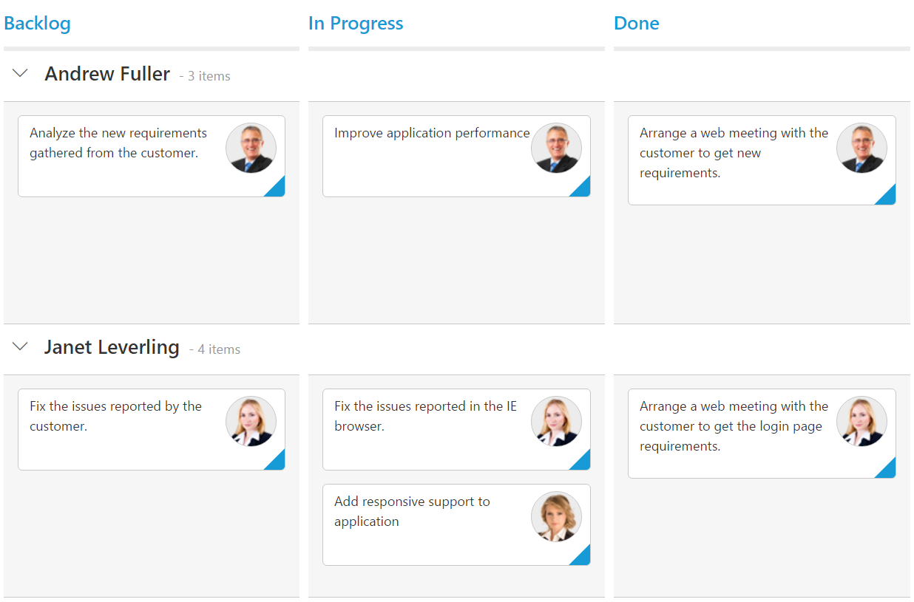
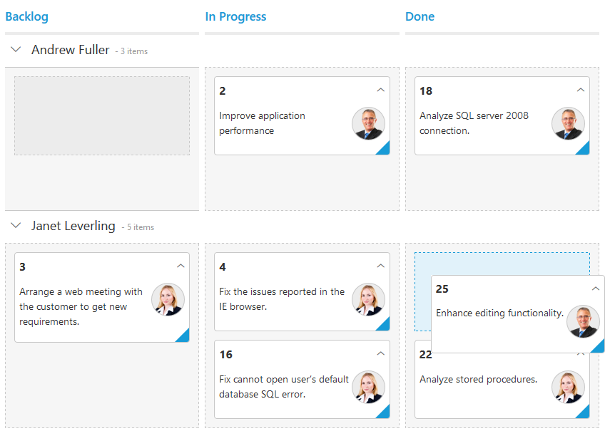

# Swim lanes

Swim lanes are a horizontal categorization of issues in the Kanban control which brings transparency to the workflow. This can be enabled by mapping the `swimlaneKey` to appropriate column name in the `dataSource`.

The following code example describes the above behavior.



    <%@ page language="java" contentType="text/html; charset=ISO-8859-1" pageEncoding="ISO-8859-1"%>
	<%@ taglib prefix="ej" uri="/WEB-INF/EJ.tld" %>
	<%@ page import="com.syncfusion.*" %><%@ page import="datasource.GetJsonData" %> 
    <body>
	
<%
    GetJsonData obj=new GetJsonData();
    Object data = obj.GetKanbanJson();
    request.setAttribute("KanbanDataSource",data);%>
    <ej:kanban id="Kanban" keyField="Status" dataSource="${KanbanDataSource}">
			<ej:kanban-fields content="Summary" primaryKey="Id" imageUrl="ImgUrl" swimlaneKey="Assignee" ></ej:kanban-fields>
			<ej:kanban-columns>
				<ej:kanban-column headerText="Backlog" key="Open"></ej:kanban-column>
				<ej:kanban-column headerText="In Progress" key="InProgress"></ej:kanban-column>
				<ej:kanban-column headerText="Done" key="Close"></ej:kanban-column>
			</ej:kanban-columns>
    </ej:kanban>
	

    </body>
    </html>
    


The following output is displayed as a result of the above code example.

## Drag And Drop between swim lanes

You can set `allowDragAndDrop` property of `swimlaneSettings` as true to enable Drag and Drop between the swim lanes.

If a card is to be dragged in the same swim lane, only a droppable target cell is added to the dotted line border. If a card is dragged from one swim lane to another, all the Kanban cells will be added to the dotted line borders, except the dragged card cell.

The following code example describes the above behavior.



    <%@ page language="java" contentType="text/html; charset=ISO-8859-1" pageEncoding="ISO-8859-1"%>
	<%@ taglib prefix="ej" uri="/WEB-INF/EJ.tld" %>
	<%@ page import="com.syncfusion.*" %><%@ page import="datasource.GetJsonData" %> 
    <body>
	
<%
    GetJsonData obj=new GetJsonData();
    Object data = obj.GetKanbanJson();
    request.setAttribute("KanbanDataSource",data);%>
    <ej:kanban id="Kanban" keyField="Status" dataSource="${KanbanDataSource}">
			<ej:kanban-fields content="Summary" primaryKey="Id" imageUrl="ImgUrl" swimlaneKey="Assignee" ></ej:kanban-fields>
			<ej:kanban-columns>
				<ej:kanban-column headerText="Backlog" key="Open"></ej:kanban-column>
				<ej:kanban-column headerText="In Progress" key="InProgress"></ej:kanban-column>
				<ej:kanban-column headerText="Done" key="Close"></ej:kanban-column>
			</ej:kanban-columns>
			<ej:kanban-swimlaneSettings allowDragAndDrop="true"/></ej:kanban-swimlaneSettings>
			
    </ej:kanban>
	

    </body>
    </html>



The following output is displayed as a result of the above code example.

