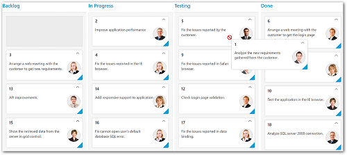

# Workflows 

Workflows can be defined to set the flow of card moving between the Kanban column statuses and it is applicable to drag and drop and context menu features.

You can set `workflows` as array of Objects which consists of `key` and `allowedTransitions` properties. The `allowedTransitions` accepts more than one transition of the specific column key mentioned in `key` property.

If a card is to be dragged to not allowed transition columns , then not supported warning symbol will be displayed for denoting the error.
        
The following code example describes the above Workflow functionality.



    <%@ page language="java" contentType="text/html; charset=ISO-8859-1" pageEncoding="ISO-8859-1"%>
	<%@ taglib prefix="ej" uri="/WEB-INF/EJ.tld" %>
	<%@ page import="com.syncfusion.*" %><%@ page import="datasource.GetJsonData" %> 
    <body>
	
<%
    GetJsonData obj=new GetJsonData();
    Object data = obj.GetKanbanJson();
    request.setAttribute("KanbanDataSource",data);%>
    <ej:kanban id="Kanban" keyField="Status" dataSource="${KanbanDataSource}">
			<ej:kanban-fields content="Summary" primaryKey="Id" priority="RankId" ></ej:kanban-fields>
			<ej:kanban-columns>
				<ej:kanban-column headerText="Backlog" key="Open"></ej:kanban-column>
				<ej:kanban-column headerText="In Progress" key="InProgress"></ej:kanban-column>
				<ej:kanban-column headerText="Testing" key="Testing"></ej:kanban-column>
				<ej:kanban-column headerText="Done" key="Close"></ej:kanban-column>
			</ej:kanban-columns>
			<ej:kanban-workflows>
				<ej:kanban-workflow allowedTransitions="InProgress" key="Open"></ej:kanban-workflow>
				<ej:kanban-workflow allowedTransitions="Testing,Close" key="InProgress"></ej:kanban-workflow>
			</ej:kanban-workflows>
    </ej:kanban>
	

    </body>
    </html>



The following output is displayed as a result of the above code example.

