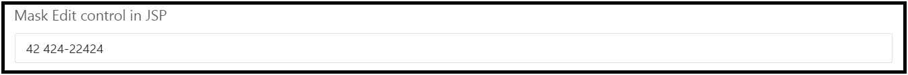

# Getting Started

This section explains briefly about how to create a **MaskEdit** in your application with JSP.

The usage of **MaskEdit** control is described in the following sections.

## Create a MaskEdit in JSP
You can create an JSP application and add necessary scripts with the help of the given [JSP Getting Started Documentation](https://help.syncfusion.com/jsp/getting-started).

Create the JSP file and add the below given code to render **MaskEdit** control with **value**, **maskFormat**, **inputMode** ,**width** properties.


      
MaskEdit control in JSP

     <ej:maskEdit id="mask" inputMode="Text" value="4242422424" maskFormat="99 999-99999" width="100%">
      


You can execute the above code example to display the **MaskEdit** control.

 

