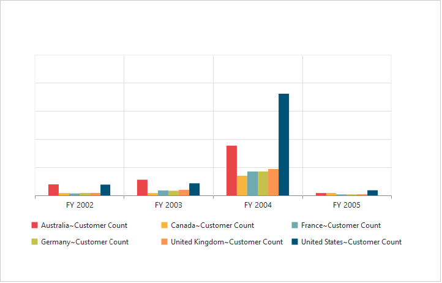
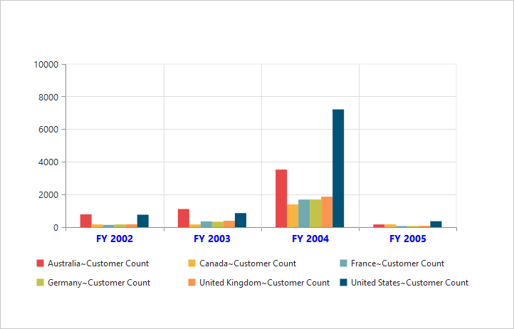
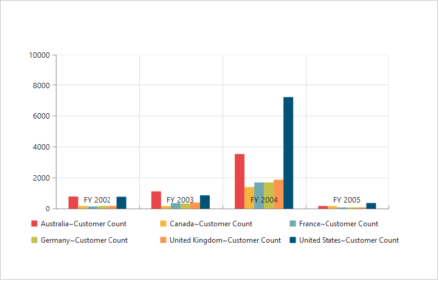
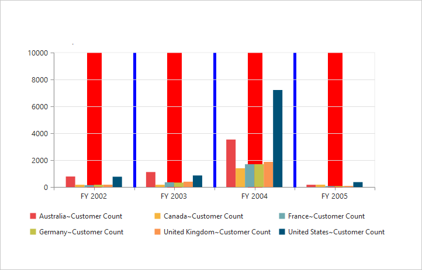
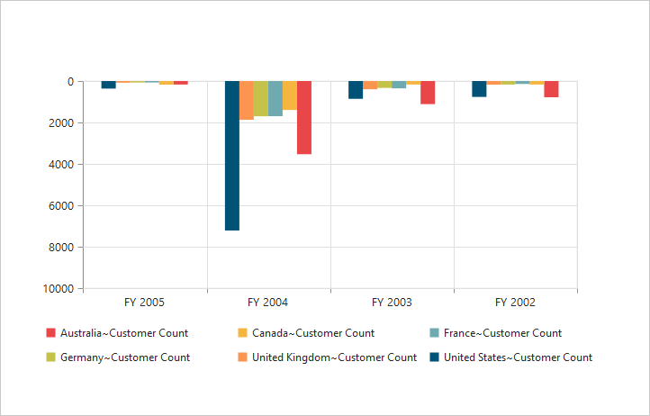
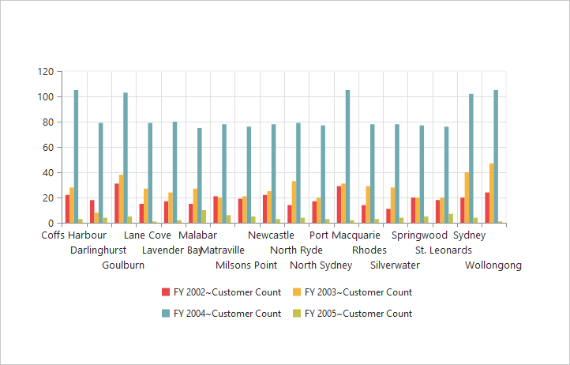

# Axes 

## Label format

### Format numeric labels
By using the `labelFormat` property, you can format the numeric labels. Numeric values can be formatted with n (number with decimal points), c (currency), and p (percentage) commands.



	

		<ej:pivotChart id="PivotChart1 load="onLoad">
		//...
		</ej:pivotChart
	

	



Following table describes the result when applying some commonly used label formats on numeric values:

<table>
<tr>
<th>
Label Value</th><th>
Label Format Property Value</th><th>
Result</th><th>
Description</th>
</tr>
<tr><td>
1000</td><td>
n1</td><td>    
1000.0</td><td>
The Number is rounded to 1 decimal place</td>
</tr>
<tr><td>
1000</td><td>
n2</td><td>    
1000.00</td><td>
The Number is rounded to 2 decimal place</td>
</tr>
<tr><td>
1000</td><td>
n3</td><td>    
1000.000</td><td>
The Number is rounded to 3 decimal place</td>
</tr>
<tr><td>
0.01</td><td>
p1</td><td>    
1.0%</td><td>
The Number is converted to percentage with 1 decimal place</td>
</tr>
<tr><td>
0.01</td><td>
p2</td><td>    
1.00%</td><td>
The Number is converted to percentage with 2 decimal place</td>
</tr>
<tr><td>
0.01</td><td>
p3</td><td>    
1.000%</td><td>
The Number is converted to percentage with 3 decimal place</td>
</tr>
<tr><td>
1000</td><td>
c1</td><td>    
$1,000.0</td><td>
The Currency symbol is appended to number and number is rounded to 1 decimal place</td>
</tr>
<tr><td>
1000</td><td>
c2</td><td>    
$1,000.00</td><td>
The Currency symbol is appended to number and number is rounded to 2 decimal place</td>
</tr>
</table>

## Common axis features

### Axis visibility
Axis visibility can be set by using the `visible` property of the respective axis.

N> By default, the value of `visible` property is true in the pivot chart.



	

		<ej:pivotChart id="PivotChart1 load="onLoad">
		//...
		</ej:pivotChart
	

	



### Label customization
By using the `font` property of the axis, you can customize the font family, color, opacity, size, and font-weight of labels.



	

		<ej:pivotChart id="PivotChart1 load="onLoad">
		//...
		</ej:pivotChart
	

	



### Label and tick positioning
Axis labels and ticks can be positioned inside or outside the chart area by using the `axisLabelPosition` and `tickLinesPosition` properties. The labels and ticks are positioned outside the chart area, by default.



	

		<ej:pivotChart id="PivotChart1 load="onLoad">
		//...
		</ej:pivotChart
	

	



### Grid lines customization
By using the `majorGridLines` and `minorGridLines` properties of the axis, you can customize the width, color, visibility, and opacity of the grid lines.

N> By default, the minor grid lines are not visible in the pivot chart.



	

		<ej:pivotChart id="PivotChart1 load="onLoad">
		//...
		</ej:pivotChart
	

	



### Tick line customization
By using the `majorTickLines` and `minorTickLines` properties of the axis, you can customize the width, color, visibility, size, and opacity of the tick lines.

N> By default, the minor tick lines are not visible in the pivot chart.



	

		<ej:pivotChart id="PivotChart1 load="onLoad">
		//...
		</ej:pivotChart
	

	



### Inversing axis
The axis can be inversed by using the `isInversed` property of the axis.

N> By default, the `isInversed` property is false in the pivot chart.



	

		<ej:pivotChart id="PivotChart1 load="onLoad">
		//...
		</ej:pivotChart
	

	



### Placing axes at opposite side
The `opposedPosition` property of the chart axis can be used to place the axis at the opposite direction from its default position.

N> By default, the `opposedPosition` property is false in the pivot chart.



	

		<ej:pivotChart id="PivotChart1 load="onLoad">
		//...
		</ej:pivotChart
	

	



## Smart axis labels

When the axis labels overlap with each other based on chart dimensions and label size, use the `labelIntersection` property of the axis to avoid overlapping.

N> By default, the `labelIntersection` property is none in the pivot chart.

* Rotate45
* Rotate90
* Trim
* MultipleRows
* Wrap
* Hide. 



	

		<ej:pivotChart id="PivotChart1 load="onLoad">
		//...
		</ej:pivotChart
	

	



