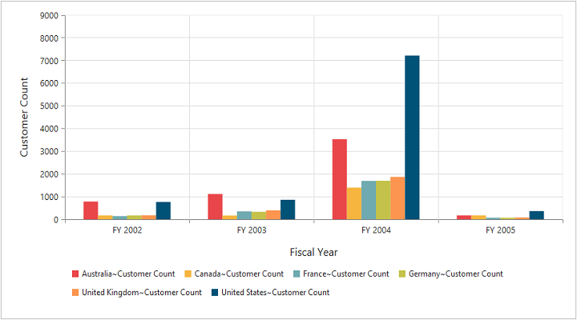
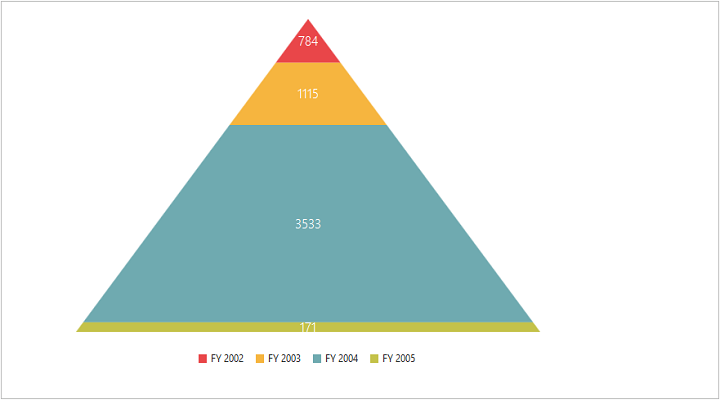
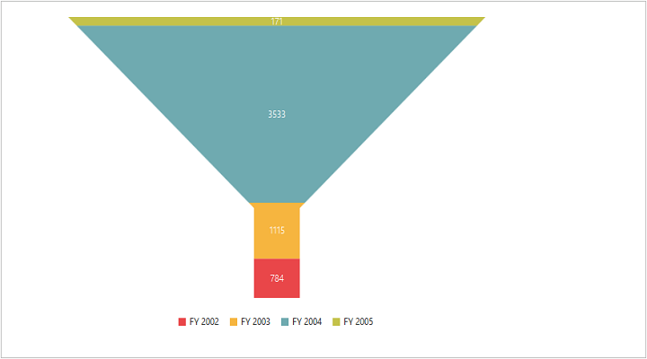
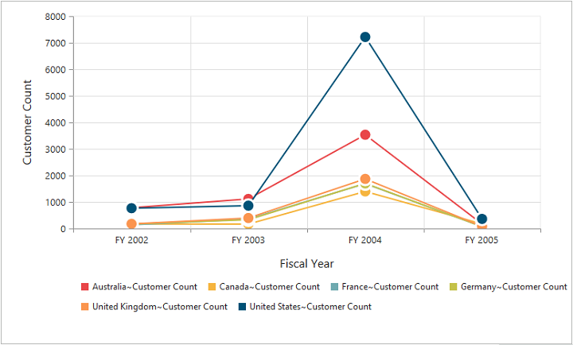
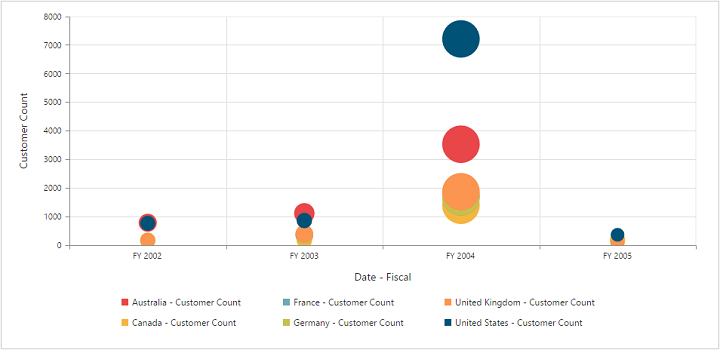
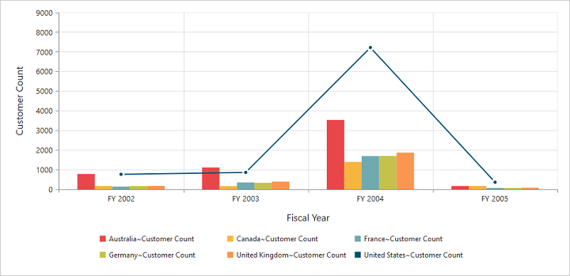

# Chart types

The Essential **PivotChart JSP** supports 17 types of charts:

* Column
* Stacking column
* Bar
* Stacking bar
* Pie
* Pyramid
* Funnel
* Line
* Step line
* Spline
* Area
* Step area
* Spline area
* Stacking area
* Doughnut
* Scatter
* Bubble

## Column chart

The **column chart** is the most commonly used chart type. This uses vertical bars (called columns) to display different values of one or more items. Points from adjacent series are drawn as bars to compare frequency, count, total, or average of data in different categories. Column chart is ideal to show the variations in the value of an item over a period of time.



	

		<ej:pivotChart id="PivotChart1>
		//...
		<ej:pivotChart-commonSeriesOptions type="column"></ej:pivotChart-commonSeriesOptions>
		</ej:pivotChart
	



The following screenshot displays **column chart**:

Column chart
{:.caption}

## Stacking column chart

The **stacking column** chart is similar to the column chart except for the Y-values. The Y-values stack on top of each other in a specified series order. This helps to visualize the relationship of parts to the whole chart across various categories.



	

		<ej:pivotChart id="PivotChart1>
		//...
		<ej:pivotChart-commonSeriesOptions type="stackingColumn"></ej:pivotChart-commonSeriesOptions>
		</ej:pivotChart
	



The following screenshot displays **stacking column chart**:

 

Stacking Column Chart
{:.caption}

## Bar chart

The **bar chart** displays horizontal bars for each point in the adjacent series. Bar charts are used to compare values across various categories for displaying the variations in the value of an item over a period of time or comparing the values of several items at a single point of time.



	

		<ej:pivotChart id="PivotChart1 load="onLoad">
		//...
		<ej:pivotChart-commonSeriesOptions type="bar"></ej:pivotChart-commonSeriesOptions>
		</ej:pivotChart
	

	



The following screenshot displays **bar chart**:

 

Bar Chart
{:.caption}

## Stacking bar chart

The **stacking bar chart** is a regular **bar** chart with X-values stacked on top of each other in the specified series order.



	

		<ej:pivotChart id="PivotChart1 load="onLoad">
		//...
		<ej:pivotChart-commonSeriesOptions type="stackingBar"></ej:pivotChart-commonSeriesOptions>
		</ej:pivotChart
	

	



The following screenshot displays **stacking bar chart**:

 

Stacking Bar Chart
{:.caption}

## Pie chart

The **pie chart** is used to summarize a set of categorical data or display different values of a given variable (e.g., percentage distribution). This type of chart is in a circular form that is divided into several segments. Each segment represents a particular category.



	

		<ej:pivotChart id="PivotChart1>
		//...
		<ej:pivotChart-commonSeriesOptions type="pie"></ej:pivotChart-commonSeriesOptions>
		</ej:pivotChart
	



The following screenshot displays **pie chart**:

 

Pie Chart
{:.caption}

## Pyramid chart

The **pyramid chart** displays data in the form of a triangle. You can visualize data in a hierarchical structure without any axes.



	

		<ej:pivotChart id="PivotChart1>
		//...
		<ej:pivotChart-commonSeriesOptions type="pyramid"></ej:pivotChart-commonSeriesOptions>
		</ej:pivotChart
	



The following screenshot displays **pyramid chart**:

Pyramid Chart
{:.caption}

## Funnel chart

The **funnel chart** displays data in the form of an inverted triangle. You can visualize data in a hierarchical structure without any axes.



	

		<ej:pivotChart id="PivotChart1>
		//...
		<ej:pivotChart-commonSeriesOptions type="funnel"></ej:pivotChart-commonSeriesOptions>
		</ej:pivotChart
	

	</script>



The following screenshot displays **funnel chart**:

Funnel Chart
{:.caption}

## Line chart

The **line chart** joins the data points on a plot by using straight lines that show the trends in data at equal intervals.



	

		<ej:pivotChart id="PivotChart1>
		//...
		<ej:pivotChart-commonSeriesOptions type="line"></ej:pivotChart-commonSeriesOptions>
		</ej:pivotChart
	



The following screenshot displays **line chart**:

 

Line Chart
{:.caption}

## Step line chart

The **step line chart** uses horizontal and vertical lines to connect data points resulting in a step like progression. 



	

		<ej:pivotChart id="PivotChart1>
		//...
		<ej:pivotChart-commonSeriesOptions type="stepLine"></ej:pivotChart-commonSeriesOptions>
		</ej:pivotChart
	



The following screenshot displays the **step line chart**:

 

Step Line Chart
{:.caption}

## Spline chart

The **spline chart** is similar to the line chart except that it connects different data points with curve lines instead of straight lines.



	

		<ej:pivotChart id="PivotChart1>
		//...
		<ej:pivotChart-commonSeriesOptions type="spline"></ej:pivotChart-commonSeriesOptions>
		</ej:pivotChart
	



The following screenshot displays **spline chart**:

 

Spline Chart
{:.caption}

## Area chart

The **area chart** emphasizes the degree of change of values over a period of time. Instead of rendering data as discrete bars or columns, the area chart renders the continuous ebb-and-flow pattern as defined against the Y-axis.



	

		<ej:pivotChart id="PivotChart1>
		//...
		<ej:pivotChart-commonSeriesOptions type="area"></ej:pivotChart-commonSeriesOptions>
		</ej:pivotChart
	



The following screenshot displays **area chart**:

 

Area Chart
{:.caption}

## Step area chart

The **step area** chart is similar to the regular area chart except for a straight line tracing the shortest path between the data points. The values are connected by continuous vertical and horizontal lines to form a step like progression.



	

		<ej:pivotChart id="PivotChart1>
		//...
		<ej:pivotChart-commonSeriesOptions type="stepArea"></ej:pivotChart-commonSeriesOptions>
		</ej:pivotChart
	



The following screenshot displays **step area chart**:

 

Step Area Chart
{:.caption}

## Spline area chart

The **spline area** chart is similar to the area chart but differs by connecting data points in a series. This connects each series of points by a smooth **spline curve**.



	

		<ej:pivotChart id="PivotChart1>
		//...
		<ej:pivotChart-commonSeriesOptions type="splineArea"></ej:pivotChart-commonSeriesOptions>
		</ej:pivotChart
	



The following screenshot displays **spline area chart**:

 

Spline Area Chart
{:.caption}

## Stacking area chart

The **stacking area** chart is similar to the regular area chart except for the Y-values. The Y-values stack on top of each other in the specified series order. This helps to visualize the relationship of parts to the whole chart across various categories.



	

		<ej:pivotChart id="PivotChart1>
		//...
		<ej:pivotChart-commonSeriesOptions type="stackingArea"></ej:pivotChart-commonSeriesOptions>
		</ej:pivotChart
	



The following screenshot displays **stacking area chart**:

 

Stacking Area Chart
{:.caption}

## Doughnut chart

The **doughnut chart** is a doughnut like structure used to summarize a set of categorical data that is divided into several segments. Each segment represents a particular category.



	

		<ej:pivotChart id="PivotChart1>
		//...
		<ej:pivotChart-commonSeriesOptions type="doughnut"></ej:pivotChart-commonSeriesOptions>
		</ej:pivotChart
	



The following screenshot displays **doughnut chart**:

Doughnut Chart
{:.caption}

## Scatter chart

The **scatter chart** displays data as a collection of points corresponding to the associated values.



	

		<ej:pivotChart id="PivotChart1>
		//...
		<ej:pivotChart-commonSeriesOptions type="scatter"></ej:pivotChart-commonSeriesOptions>
		</ej:pivotChart
	



The following screenshot displays **scatter chart**:

 

Scatter Chart
{:.caption}

## Bubble chart

The **bubble chart** displays data as a collection of bubbles.



	

		<ej:pivotChart id="PivotChart1>
		//...
		<ej:pivotChart-commonSeriesOptions type="bubble"></ej:pivotChart-commonSeriesOptions>
		</ej:pivotChart
	



The following screenshot displays **bubble chart**:

Bubble Chart
{:.caption}

## Combination chart

The **combination chart** combines two or more series types in a single chart, but there are some limitations in the combination chart. They are:

1. The combination chart cannot combine column and bar series.
2. The pie chart cannot be used with other series types.



	

		<ej:pivotChart id="PivotChart1 load="onLoad">
		//...
		<ej:pivotChart-commonSeriesOptions type="column"></ej:pivotChart-commonSeriesOptions>
		</ej:pivotChart
	
	
    
	



The following screenshot displays **combination chart**:

