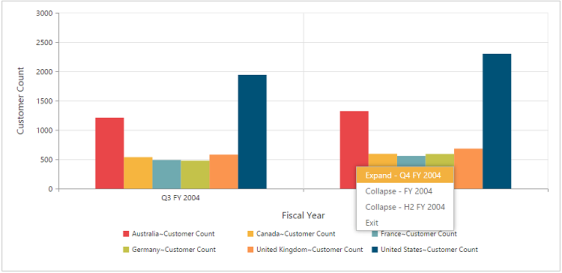
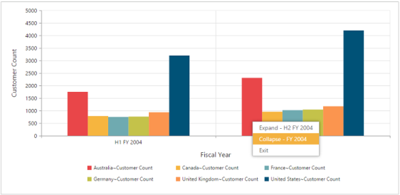

# Drill operation

This is a basic feature of the pivot chart through which the amount of information can be limited for a better view. It allows you to drill down to access the detailed level of data or drill up to see the summarized data by using the context menu present in the pivot chart.

Drill up, also called roll up, navigates from the inner most level (having detailed member information) to any of the outer levels.

Drill down, also called roll down, is the reverse of drill up. It navigates from any of the outer levels to the inner most level.

The drillSuccess event will be triggered when you right-click the pivot chart and select any option available in the context menu to perform drill up or drill down operation.



	

		<ej:pivotChart id="PivotChart1 drillSuccess="DrillSuccess">
		//...
		</ej:pivotChart
	

	



