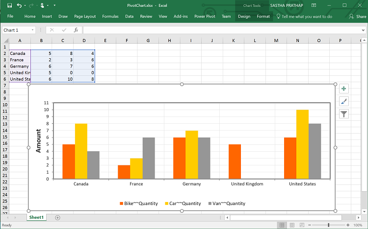

# Exporting

The pivot chart control can be exported to the following file formats:

* Microsoft Excel
* Microsoft Word
* PDF
* Image

The pivot chart control can be exported by invoking the **“exportPivotChart”** method with an appropriate export option as a parameter.

## Excel export

You can export the contents of the pivot chart to an Excel document for future archival, references, and analysis purposes.

To achieve Excel export, the method name **"ExcelExport"** and the file name are set as parameters.



	

		<ej:pivotChart id="PivotChart1>
		//...
		</ej:pivotChart
	

    

        <ej:button id="button" text="Export" size="large" showRoundedCorner="true" click="exportButtonClick"></ej:button>
    

    
	



## Word export
You can export the contents of the pivot chart to a Word document for future archival, references, and analysis purposes.

To achieve Word export, the method name **"WordExport"** and the file name are set as parameters.



	

		<ej:pivotChart id="PivotChart1>
		//...
		</ej:pivotChart
	

    

        <ej:button id="button" text="Export" size="large" showRoundedCorner="true" click="exportButtonClick"></ej:button>
    

    
	



## PDF export

You can export the contents of the pivot chart to a PDF document for future archival, references, and analysis purposes.

To achieve Word export, the method name **"PDFExport"** and the file name are set as parameters.



	

		<ej:pivotChart id="PivotChart1>
		//...
		</ej:pivotChart
	

    

        <ej:button id="button" text="Export" size="large" showRoundedCorner="true" click="exportButtonClick"></ej:button>
    

    
	



## Image export
You can export the contents of the pivot chart to image format for future archival, references, and analysis purposes. You can export the pivot chart to the following image formats:

* PNG
* EMF
* JPG
* GIF
* BMP

To achieve image export, the method name **"ImageExport"** ,**“ej.PivotChart.ExportOptions.PNG”** and the file name are set as the parameter. This is similar to other image formats.



	

		<ej:pivotChart id="PivotChart1>
		//...
		</ej:pivotChart
	

    

        <ej:button id="button" text="Export" size="large" showRoundedCorner="true" click="exportButtonClick"></ej:button>
    

    
	



## Pivot chart format selection

I> This option is applicable only for the pivot chart specifically when exported to an Excel document.

You can set an option to export the pivot chart to an Excel document as an image or pivot chart format itself by setting the Boolean property `exportChartAsImage` in the `beforeExport` event.

N> By default, the pivot chart will be exported in image format to an Excel document.



	

		<ej:pivotChart id="PivotChart1 beforeExport="BeforeExport">
		//...
		</ej:pivotChart
	

    

        <ej:button id="button" text="Export" size="large" showRoundedCorner="true" click="exportButtonClick"></ej:button>
    

    
	



The following screenshot shows the control exported to an Excel document showing its own format (pivoting chart):

## Exporting customization

You can add the title and description to the exporting document by using the title and description property obtained in the "beforeExport" event.

N> The title and description cannot be added to image formats.



	

		<ej:pivotChart id="PivotChart1 beforeExport="BeforeExport">
		//...
		</ej:pivotChart
	

    

        <ej:button id="button" text="Export" size="large" showRoundedCorner="true" click="exportButtonClick"></ej:button>
    

    
	



The name of the document can be customized as per the user's requirements.

You should send the file name as parameter to the **“exportPivotChart”**  method along with service URL.



function exportButtonClick(args)
{
    var chartObj = $('#PivotChart1').data("ejPivotChart ");
    chartObj.exportPivotChart("http://js.syncfusion.com/ejservices/api/PivotChart/Olap/ExcelExport", "fileName");
}
    

The following screenshot shows the pivot chart control exported to an Excel document:

The following screenshot shows the pivot chart control exported to a PDF document:

The following screenshot shows the pivot chart control exported to a Word document:

The following screenshot shows the pivot chart control exported to a PNG format:

